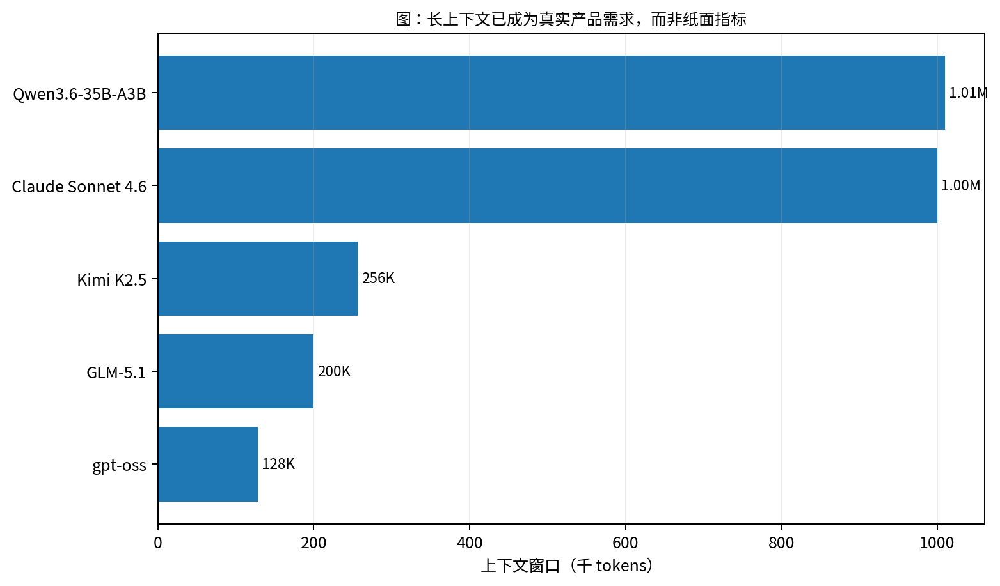
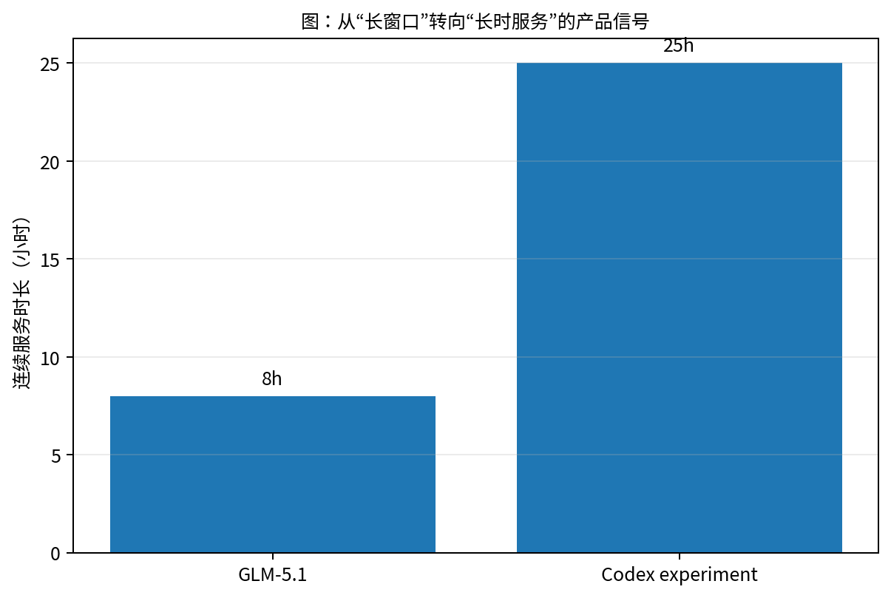
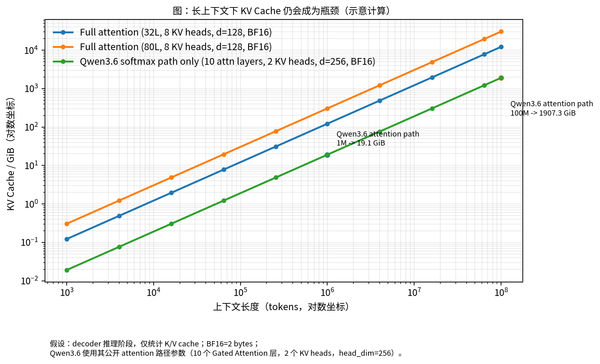
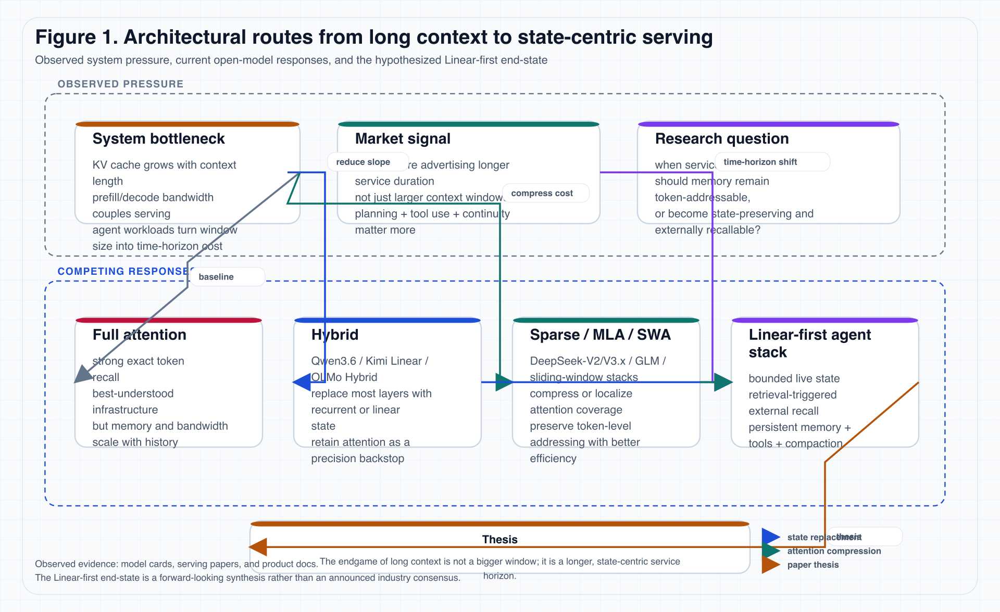
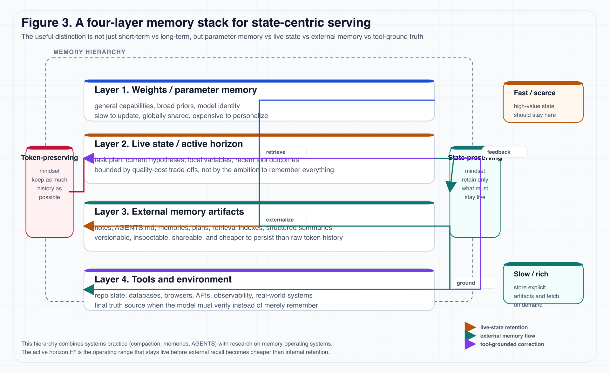
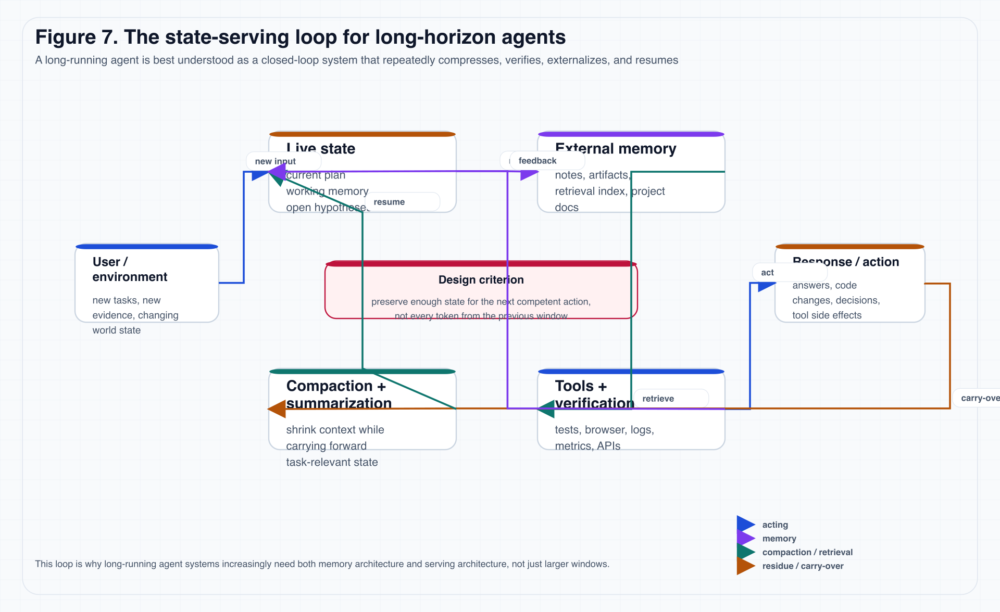
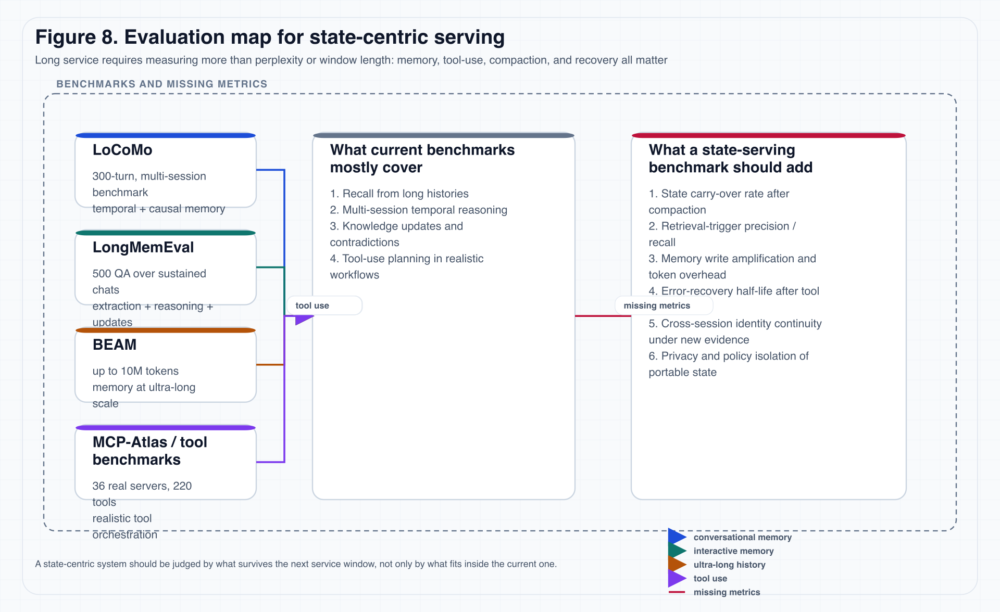
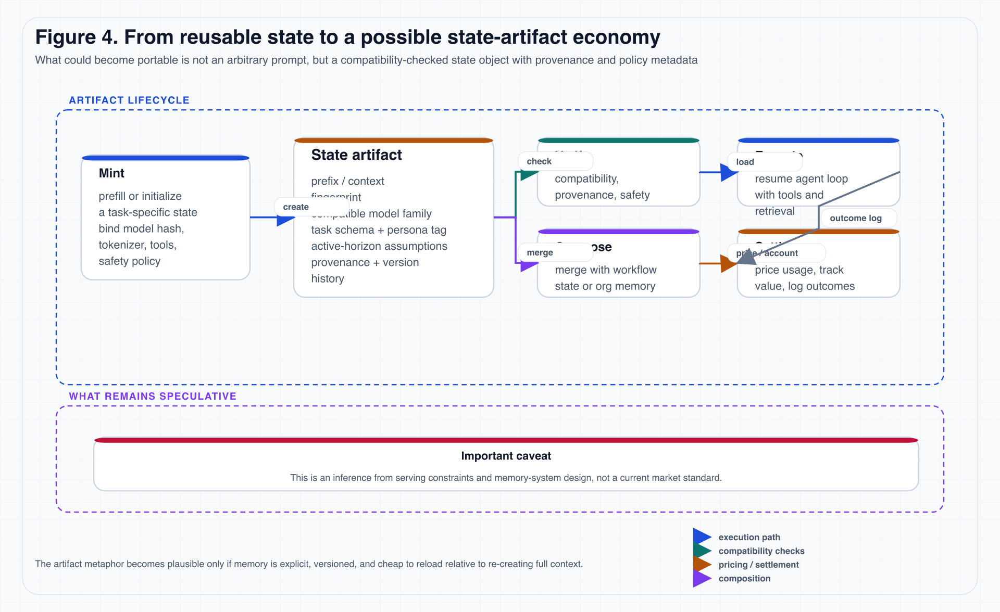

# From Ultra-Long Context to Lifelong Service

## Why Open Models Are Likely to Become State-Centric Serving Systems

*A research-style blog draft that puts architectural divergence, long-horizon agents, external memory, and possible state assets into one systems frame*  
*Review Draft · 2026-04-21*

> Status: review draft only; not yet merged into `_posts/`.  
> Method note: the essay tries to separate source-backed facts from systems inferences and future-facing speculation.  
> Figure note: Figures 1, 3, 4, 7, and 8 were redrawn in this round; Figures 2, 5, and 6 keep the quantitative plots from the initial package.

---

## Abstract

Over the last year, the long-context race has clearly changed shape.

At the surface level, the field still compares 128K, 256K, and 1M windows.

But when we place model cards, official documentation, serving papers, and long-horizon agent product signals side by side, the real object of competition is no longer the number of tokens that fit into a single request.

It is the ability to keep a model system alive, coherent, and economically viable over a long service horizon.

That is the central claim of this essay:

> **The endgame of long context is not a bigger window. It is a longer service lifetime.**

Once the problem is rewritten from `bigger window` to `longer service horizon`, the design center moves away from “preserve as many tokens as possible” and toward “preserve enough live state at acceptable cost, then recover precision through external memory and tools when needed.”

Under that framing, today's Hybrid, Sparse, MLA, and SWA routes remain important, but they look more like transition architectures than final ones.

A more plausible end-state is a stack organized around **Linear-first modeling + External Memory + Tool-Grounded Verification**.

The essay proceeds in three arcs.

The first arc reframes the problem from “window length” to “service duration”: why long context becomes a serving problem, and why KV cache, prefill/decode bandwidth, and context residue become system bottlenecks.

The second arc enters the architectural split: what Hybrid, Sparse / MLA / SWA, and Pure Linear each solve, and why all of them should be interpreted inside a larger state-centric serving grammar.

The third arc discusses the system consequences: the four-layer memory stack, state-serving evaluation, compatibility boundaries for state artifacts, and the different roles tokens and states might play in future service economics.

---

## 0. Method and Problem Definition

This is not a pure survey paper, and it is not unconstrained speculation either.

More precisely, it tries to answer a question that sits between model architecture, inference systems, and agent engineering:

> **As service length \(T \to \infty\), can model systems keep depending on token-preserving memory?**

Here `T` is not the token count of one request.

It is the total duration, iteration count, and accumulated context residue of a real task in the world.

Once we place a model inside coding agents, research agents, or workflow agents, it is no longer facing a static prompt of fixed length.

It is facing a service chain that grows over time, gets compacted, gets externalized, gets retrieved again, and continually exchanges state with tools and environment.

Accordingly, `state-centric serving` in this essay does not refer to a universally standardized industry term.

It refers to a combination of system properties:

1. The model keeps only high-value, service-sustaining live state internally.
2. Information outside the active horizon is explicitly externalized into memory artifacts.
3. When internal state is insufficient, the system recovers precision through retrieval, tool use, document memory, and verification.
4. The service layer must support compaction, resume, carry-over, and cross-session continuity, rather than only single-shot inference.

To avoid disguising inference as fact, the essay uses a simple evidence hierarchy.

### 0.1 Evidence levels used in this essay

| Level | Meaning | Typical sources | How it is used |
|---|---|---|---|
| A | Direct fact | model cards, official docs, explicit paper claims | cited and used directly |
| B | Systems interpretation | synthesis across multiple A-level facts | labeled as the essay's judgment |
| C | Forward-looking speculation | possible state portability, state assets, settlement structure | explicitly marked as speculative |

### 0.2 Central proposition

The real goal of the essay is not to show that one current model is categorically “better” than another.

It is to defend the following chain:

1. The rise of long-horizon agents makes service continuity more important than raw window capacity.
2. Once continuity becomes the main goal, token-addressable memory creates compounding cost, bandwidth, and governance burdens.
3. Therefore model systems are likely to move toward **bounded live state + external recall + tool-grounded verification**.

---

## 1. What Is Really Being Competed Over: Not Bigger Windows, but Longer Service

Many conversations about long context remain trapped in an overly static frame:

- Model A supports 128K.
- Model B supports 256K.
- Model C supports 1M.

That comparison matters, but it only describes the capacity boundary of a **single request**.

It says much less about a model's ability to remain useful throughout a long task.

And the agent systems that matter most are increasingly not those that “answer one prompt correctly once,” but those that keep planning, call tools across many steps, preserve state across context windows, revise earlier conclusions when new evidence appears, and maintain identity, goal, and environment continuity over long spans.

### 1.1 Public signals are already shifting from “window” to “service duration”

The table below lines up several representative public signals.

| System / source | Public signal | Why it matters here |
|---|---|---|
| Claude Sonnet 4.6 (Anthropic) | official materials tie 1M-token context to codebase-scale reasoning and long-horizon planning | the context window is being framed as a planning interface, not only a capacity number |
| Codex (OpenAI) | the official long-horizon blog reports an experiment running for about 25 hours, consuming about 13M tokens, and producing about 30,000 lines of code | service duration is being productized explicitly |
| GLM-5.1 (Z.AI) | official overview materials position long-horizon agent, coding, and browser automation as core use cases, including an 8-hour autonomy signal | long-running work is part of the model's public identity |
| Kimi K2.5 (Moonshot) | documentation emphasizes 256K context, long context, and multi-step tool invocation | window size is embedded inside agent workflow, not treated as an isolated spec |
| Qwen3.6 (Qwen Team) | the model card exposes both long-context capability and a Hybrid architecture | the structure itself is already responding to long-service cost pressure |

In other words, the most important change is no longer just that “more tokens fit into one forward pass.”

It is that:

> **models are being asked to remain alive inside the same task for much longer.**

That is harder than “seeing more history,” because it simultaneously demands:

1. continuity of plan;
2. continuity of state;
3. continuity of environment;
4. continuity of cost.

Those four continuities correspond to four different failure modes.

When plan continuity fails, the model may still “know” relevant facts from the context, but it forgets why the current action matters.

When state continuity fails, it may remember the high-level goal while losing intermediate variables, local constraints, open decisions, and unfinished work.

When environment continuity fails, its picture of reality drifts behind the repository, browser, database, or logs.

When cost continuity fails, the system appears to keep working, but every step carries a heavier history burden until serving cost becomes unsustainable.

So long service is not simply “put a longer chat transcript into the prompt.”

It is more like asking an engineer to stay on duty for many hours, repeatedly hand off work, read logs, edit code, run tests, revise hypotheses, and leave enough trace for the next wake-up not to start from zero.

### 1.2 Window length is only a local projection of service length

From a systems perspective, window length is only a local projection of deeper questions:

- After how long will early information be pushed out of the live context?
- After compaction, can the system still recover the state that matters?
- Are external memory artifacts structured enough to support reliable resume?
- Do tool results accumulate into durable state, or are they repeatedly re-derived?

This is why equating “1M context” with “lifelong memory” is already a conceptual mismatch.

A coding agent makes the mismatch easy to see.

A large codebase may fit inside a 1M-token window, but real engineering work is rarely just “read the whole repository and answer a question.”

It usually looks more like an engineering pipeline: understand the request -> locate relevant modules -> edit files -> run tests -> inspect failure logs -> revise the implementation -> record tried paths -> finally produce a PR or handoff note.

What needs to persist is not necessarily the raw text of the first million tokens.

It is the state of which hypotheses were falsified, which tests failed, what the current diff means, and which risks remain unverified.

Those objects are closer to state than to raw context.

Figures 5 and 6 matter not because they announce bigger numbers, but because they separate two different axes.

*Figure 5. Public long-context signals still matter, but they are only one interface of the broader service system. Data comes from model cards and official docs.*

*Figure 6. The more interesting shift is that long tasks are being explicitly productized: planning, continuous execution, tool use, and sustained delivery are entering the mainstream narrative.*

### 1.3 A more accurate question

Based on those observations, the essay no longer frames the problem as:

> Who can build the largest context window?

It reframes it as:

> **Who can maintain a stable working state for longer service durations at a more manageable persistent memory cost?**

Once the question is phrased this way, the center of attention shifts from window competition to state management.

---

## 2. Why Ultra-Long Context Ultimately Becomes a Serving Problem

Long context obviously touches model architecture, but in practice it is first and foremost a serving issue.

Once the context becomes very long, the main constraints almost all emerge at inference time: KV cache grows with history length, prefill and decode bandwidth are dragged down by long histories, prefix reuse and cache matching become more complex, and multi-tenant memory and throughput budgets get stretched. More importantly, the “residue” of long-horizon agents stops being equivalent to plain text history.

### 2.1 A simple but sufficient KV-cache formula

For decoder-only models, inference-time KV cache can be roughly written as:

`KV bytes ≈ T × L × H_kv × d_head × 2 × bytes_per_elem`

Here `T` is the number of cached tokens, `L` is the number of attention layers, `H_kv` is the number of KV heads, and `d_head` is the head dimension. The `2` accounts for K and V, while `bytes_per_elem` is commonly 2 under BF16.

The formula is simple, but it already makes the crucial point:

> **As long as the system depends on length-dependent token cache, service cost will keep compounding with history.**

It is worth emphasizing that KV cache is not “historical text sitting quietly in memory.”

It is a runtime object repeatedly accessed, moved, and scheduled during decoding.

When context is short, KV cache is like a convenient note on the workbench.

When context grows to hundreds of thousands or millions of tokens, it becomes more like an expanding supply chain: each newly generated token still has to interact with that chain through lookup, movement, and bandwidth scheduling.

That is why long context is often not a simple capacity problem, but a joint systems problem involving VRAM, HBM bandwidth, batching, prefix reuse, cache eviction, and sometimes cross-node transfer.

That is why most long-context optimizations are not truly “solving memory” in a final sense.

They are mostly:

- delaying the blow-up point;
- reducing the blow-up slope;
- converting part of the length-dependent cache into length-independent state.

### 2.2 Figure 2 is not about “whose curve looks nicer”

The initial draft's Figure 2 remains useful because it captures the engineering intuition well:

*Figure 2. Even when only a minority of layers keep attention, length-dependent cache pressure still grows with context length.*

What the figure really says is:

- if attention layers remain, length-dependent cost remains;
- if service must last hours or longer, history length becomes a resource-scheduling problem, not just a context problem;
- if the task includes tool calls, file edits, log inspection, or browsing, then “what should persist into the next step” matters more than “which tokens should remain verbatim.”

### 2.3 A key serving signal: memory objects are being separated

Moonshot's Prefill-as-a-Service paper matters here not because it directly proposes a “state market,” but because it makes the memory objects inside next-generation serving more legible.

At minimum, work like this gives us three important signals:

1. Long histories are no longer only a single-machine memory problem; they may become a cross-node or even cross-datacenter scheduling problem.
2. In Hybrid architectures, part of the recurrent state is independent of input length, which means the serving layer is already leaning toward bounded state.
3. Once a service system must transport, reuse, resume, and account for state repeatedly, the boundary of the memory object becomes much more explicit.

This is why the next stage of long context looks less like an extreme attention kernel story and more like a memory-serving protocol story.

The same point becomes even clearer under agent workloads.

In a one-shot question-answering setting, history can mostly be treated as input.

In a long-lived service, however, history is continually rewritten into different forms. Some remains in the current context, some becomes summaries or external files, some becomes tool output and test logs, and some becomes negative experience: “do not try this path again.”

Those objects have different lifetimes, access frequencies, validation methods, and privacy properties.

Calling all of them “context” hides the most important design differences.

### 2.4 Infrastructure maturity also changes architecture choices

MiniMax's M2 retrospective matters for the same reason.

Its value is that it does not simply repeat the abstract slogan that “linear attention is cheaper.”

It drags the question back into industrial serving reality: prefix caching, low-precision state, speculative decoding, infrastructure maturity, and whether training gains justify the added systems complexity.

This makes an often-overlooked point explicit:

> **Architectural elegance does not automatically translate into industrial serving superiority.**

So throughout the essay, I distinguish between two notions of “better”:

- better for training a strong model today;
- better as a substrate for long-lived service tomorrow.

---

## 3. Why Open Models Have Split into Hybrid, Sparse, and a Linear-First Imagination

The pressure created by long context does not automatically converge on a single answer.

Instead, it has pushed open models toward several different practical routes.

### 3.1 A more useful route map

Figure 1 compresses the current design space used in this essay.

*Figure 1. The diagram deliberately separates observed engineering responses from the essay's forward-looking judgment, so that speculation is not smuggled in as settled fact.*

### 3.2 What the three common routes are actually solving

| Route | Immediate goal | Representative signal | What it really solves | What it does not solve |
|---|---|---|---|---|
| Full Attention | preserve exact token-to-token recall | classic Transformers and some industrial high-performance systems | high-fidelity recall, mature infra | memory and bandwidth scale with history |
| Hybrid | replace most attention layers with bounded recurrent or linear state | Qwen3.6, Kimi Linear, OLMo Hybrid | converts much of the length-dependent cache into length-independent state | still keeps attention as a precision backstop |
| Sparse / MLA / SWA | preserve token-addressable memory while reducing coverage cost | DeepSeek-V2/V3.x, GLM-family systems, sliding-window stacks | better cost/recall balance | memory is still primarily preserved in token form |

Hybrid is perhaps the most misunderstood route in this landscape.

A better way to understand the routes is to place them on two axes.

The first axis is **recall fidelity**: how strongly the system preserves exact token positions and token-to-token interaction.

The second axis is **state compactness**: how willing the system is to compress history into a smaller, harder-to-inspect, but cheaper state.

Full Attention sits near the extreme of recall fidelity.

Pure Linear sits near the extreme of state compactness.

Hybrid and Sparse move toward the middle from opposite sides: Hybrid prioritizes compacting state in most layers, while Sparse prioritizes preserving the usefulness of token-addressability.

It is often treated as a “half-finished Pure Linear model,” but that is not quite right.

It is better understood as a structural admission of the following fact:

> for now, the safest solution is to separate state tracking from precision recall across different layers.

### 3.3 Three representative cases

#### Qwen3.6: openly retaining attention in only a minority of layers

The Qwen3.6 model card matters not merely because it publishes long-context numbers.

It matters because it exposes a structural fact central to this essay:

- only a minority of the 40 layers remain Gated Attention;
- most of the stack has moved toward Gated DeltaNet-style state updates;
- the model's native context capability reaches 262,144 tokens, with room to extend further, and it is explicitly positioned for very long context.

In other words, the model card itself effectively acknowledges:

> **for long service, the system is already willing to give up the uniformity of “full attention everywhere.”**

The engineering implication is strong.

If every layer remains full attention, then every layer carries a length-dependent runtime burden.

A structure like Qwen3.6 makes an explicit division of labor inside the model: a minority of layers remain closer to precision recall, while most layers focus on state update and compression.

That is not a minor parameter choice.

It is a structural response to the cost pressure of long context.

#### Kimi Linear: making Hybrid's serving gains explicit

Moonshot's `Kimi Linear` repository matters for a similar reason.

It explicitly claims:

- a 3:1 KDA-to-MLA ratio;
- 1M context;
- up to 75% KV-cache reduction in supported settings;
- substantially higher long-sequence decoding throughput.

This means the value of Hybrid is not only theoretical.

It is being packaged as a serving advantage.

That matters especially for a blog audience.

Architecture discussions often stop at asymptotic symbols such as `O(n^2)` versus `O(n)`.

But what makes a route enter production is not the symbol itself; it is whether the route improves decode throughput, memory footprint, cache hit behavior, deployment stability, and multi-tenant cost.

Kimi Linear is worth citing because its public framing connects architecture directly to serving benefits.

#### DeepSeek-V2: proving that compressed token-addressable memory remains powerful

The DeepSeek-V2 paper strongly supports the other branch of the split.

Through Multi-head Latent Attention it compresses K/V representations and reports a 93.3% KV-cache reduction relative to DeepSeek 67B.

The philosophical implication of that route is:

- one does not need to abandon token-addressable recall immediately;
- one can compress token memory into a more manageable engineering regime first;
- for many current workloads, that compromise remains highly competitive.

From a product perspective, this also explains why Sparse / MLA-like routes remain so viable in the near term.

Many tasks do not require lifelong service, but they do require precise citation, precise code localization, accurate long-document QA, and stable tool calls.

In such workloads, abandoning token-addressability too early may cost too much interpretability and recall reliability.

Sparse / MLA is therefore not a backward conservative choice.

It is a rational response to today's task distribution.

### 3.4 OLMo Hybrid as a Counterexample: Transitional Architecture Is Not Necessarily Weak

AllenAI's OLMo Hybrid provides an important counterexample for the essay.

If Hybrid were merely “a weaker architecture that saves memory,” its relevance to future design would be limited.

But the public materials indicate that OLMo Hybrid not only remains stable on longer contexts, but can also use fewer tokens than a comparison model to reach the same MMLU level in certain settings, while achieving stronger RULER outcomes after extension.

That forces us to accept the following:

> **closer to the endgame does not necessarily mean stronger today; conversely, stronger today does not mean closer to the endgame.**

---

## 4. Why Hybrid and Sparse Still Look Transitional

If we care only about the engineering present of 2026, both Hybrid and Sparse are powerful.

The reason this essay still treats them as transitional is not that they are weak.

It is that neither of them fully completes the deeper migration:

> **from token-preserving memory to state-preserving memory.**

### 4.1 What Hybrid really achieves: converting most layers into length-independent state

Hybrid's deepest structural significance is that it turns many layers from “length-dependent cache” into “length-independent state.”

That matters because it splits the model's memory objects into two distinct categories:

1. token cache that still scales with history length;
2. recurrent state that is largely independent of history length.

From a serving perspective, this is already more than an attention variant.

It is a redesign of the memory object.

### 4.2 What Sparse / MLA really achieves: keeping token-addressability while pushing cost down

Sparse, MLA, and SWA-style systems do something different.

They do not force the world to move from token memory to state memory immediately.

Instead, they try to preserve token-level exact recall while engineering coverage range, head representation, sliding windows, block reuse, and locality into a more acceptable operating point.

So the philosophy of that route is not “I no longer need token memory.”

It is:

> **I still need token memory, but I need it to become cheaper.**

### 4.3 Why neither route looks like the final state

Once task length keeps increasing into more extreme regimes, such as:

- 10M-token-scale histories;
- coding agents running across multiple days;
- organization-scale memory systems;
- service chains that repeatedly compact, summarize, restore, and verify;

the following questions return with full force:

1. what history truly needs to remain token-addressable?
2. what should be distilled into smaller live state?
3. what should be written into external memory artifacts?
4. what external objects should be treated as more stable recoverable state than natural-language history?

As long as these questions cannot be avoided, the system is likely to move into a new phase:

> **it will no longer be organized around preserving all history, but around preserving enough state to keep working competently.**

Consider a concrete coding-agent scenario.

Suppose an agent has been working for six hours.

It has read hundreds of files, run dozens of tests, tried three incorrect repair paths, produced a medium-sized diff, and discovered that one flaky test is unrelated to the current change.

If we preserve the entire history verbatim, cost becomes high and many tokens add no marginal value to the next step.

If we preserve only a summary, the model may lose crucial details such as which failure was unrelated, which mock must not be edited, or which API contract has already been verified.

The more reasonable design is layered state: keep the current diff and unresolved failure in live state; write failed paths into external notes; keep test logs and repository state as retrievable, verifiable artifacts; and if needed later, re-verify with tools instead of trusting memory.

That is what state-centric serving means in concrete terms.

### 4.4 A more precise conclusion

So the essay does not claim that Hybrid will soon disappear.

A more accurate formulation is:

- **Hybrid may remain one of the most practical routes to strong models for years.**
- **Sparse / MLA-style methods will likely remain central in high-performance serving.**
- **But as service lifetime grows, the overall system organization will become increasingly state-centric.**

That is the real meaning of “transitional” here.

It does not mean “about to be discarded.”

It means “ultimately explained inside a larger systems grammar.”

---

## 5. Why Pure Linear Looks More Like an Endgame Candidate, and Why It Is Hard

If we accept the previous section, a natural question follows:

> Why not keep going and remove the remaining attention layers?

That question is natural, but also deeply misleading if taken too literally.

### 5.1 Pure Linear will not emerge by simple subtraction

It is tempting to imagine Hybrid as a monotonic path:

`Full Attention -> Hybrid -> Less Hybrid -> Pure Linear`

But trained models do not behave that way.

Once a model develops a functional division of labor during pretraining, the “remaining attention layers” are not merely leftover baggage that has not yet been deleted.

They often carry:

- long-range exact lookup;
- high-fidelity re-localization;
- complex re-binding;
- precision backstops after layer specialization.

That is also why distillation work such as HALO introduces attention layer selection explicitly.

It is effectively telling us:

> **not all attention layers are equivalent, and not all of them can be removed painlessly.**

### 5.2 RADLADS and HALO show convertibility, not easy final retrofitting

RADLADS shows that a softmax-attention teacher can be distilled into a linear decoder efficiently.

HALO further shows that distilling a Transformer into a Hybrid model can also be effective.

Those are genuinely encouraging results.

But what they prove is:

- post-hoc conversion is possible;
- distillation curriculum can reduce extra training cost;
- linear or hybrid models do not have to emerge from a fully isolated training lineage;

What they do **not** prove is this:

> that the best future Pure Linear frontier model can be obtained cheaply by “retrofitting the remaining attention away later.”

That is a much stronger claim.

### 5.3 The real difficulty is data engineering

The essay's view here is straightforward:

> **if Pure Linear is to become a true long-service substrate, the biggest bottleneck is probably not the operator itself, but data engineering.**

A linear-state model that merely learns to predict the next token with lower memory cost is still not a long-horizon agent substrate.

It must also learn three more agentic behaviors: what should remain in live state, what should be externalized into memory, and when to trigger retrieval, tool-grounded verification, or task recovery after compaction.

None of those behaviors appear automatically because an attention kernel has been replaced.

So the required data is not merely “longer ordinary text.”

Better training data falls into three groups. The first is streaming task execution traces, including mid-task state compression and details queried only after long delays. The second is recovery data, including tool-failure repair and documented intermediate decisions. The third is memory-selection data, including irrelevant history that is explicitly forgotten or downgraded, plus paired examples of successful and failed retrieval.

In other words, the model needs to see a behavioral pattern:

> some things must stay in the head, some things must be written down, some things must be checked again, and some things should be forgotten deliberately.

That is much harder than “show the model a longer book.”

### 5.4 Active Horizon: the goal is not “infinite internal memory”

Another misconception should be addressed directly.

Calling the future state-centric does **not** mean claiming that future models will enjoy “infinite internal memory.”

If anything, a linear-state system is more likely to seek an optimized **active horizon \(H^\*\)**:

`H* = argmin( state-maintenance cost + external-retrieval cost + forgetting loss )`

This is not a formal formula quoted from a paper.

It is an engineering notation introduced here to express the trade-off.

Its meaning is simple:

- if too much state is kept internally, cost rises;
- if external retrieval is triggered too often, throughput and stability suffer;
- if compaction is too aggressive, forgetting loss harms the task directly.

So the real goal is not “remember everything forever.”

It is:

> **retain the smallest live state that still supports the next competent action without collapsing service quality.**

---

## 6. A More OS-Like Systems Picture

Once the notion of `active horizon` is accepted, a different picture emerges naturally.

Long-horizon agents are not powered by one gigantic context window.

They are powered by a layered memory system.

### 6.1 The four-layer memory stack

Figure 3 shows the stack used in this essay.

*Figure 3. The diagram explicitly separates parameter memory, live state, external memory artifacts, and tool-ground truth, because they differ in update speed, cost, auditability, and governance.*

The four layers are:

1. **Weights / Parameter Memory**  
   broad capabilities, general priors, model identity.

2. **Live State / Active Horizon**  
   current plan, local variables, recent observations, short-term task identity.

3. **External Memory Artifacts**  
   summaries, plans, explicit instructions, memory files, retrieval indexes, organizational knowledge, workflow state.

4. **Tools & Environment**  
   final truth: code, databases, browsers, logs, metrics, APIs, real systems.

One way to imagine the stack is to think of a researcher at work.

Model weights are like long-term education: they determine whether the researcher can read papers, write code, and interpret statistical figures.

Live state is the scratch paper currently on the desk: the active hypothesis, the next thing to test, and the path that just failed.

External memory artifacts are lab notes, project docs, citation managers, and todo lists: they are not in the researcher's head every second, but they preserve traceable process.

Tools and environment are the instruments and real data tables: when memory and notes disagree, the system must measure again here.

Many long-horizon agent failures come from mixing these layers: treating model confidence as instrument output, summaries as logs, and prompts as project memory.

### 6.2 Why this is more useful than “short-term vs long-term memory”

Many essays on agent memory divide the world only into:

- short-term memory;
- long-term memory.

That is enough for pedagogy, but not enough for real service systems.

It collapses two distinctions that become essential in practice:

1. parameter memory is not the same thing as runtime state;
2. external memory is not the same thing as environment truth.

For example:

- `AGENTS.md`, `MEMORY.md`, plans, notes, and retrieval indexes all belong to external artifacts;
- but test output, browser state, database contents, or real repository state belong to environment truth.

That distinction matters because a system that collapses them will eventually start substituting summaries for verification and memory for truth.

### 6.3 Official agent engineering practice is already moving this way

Anthropic and OpenAI documentation already point in this direction.

For example:

- `AGENTS.md` is treated as an explicit instruction layer;
- memories act as an externalized carrier of stable preferences and workflows;
- compaction is treated as necessary for preserving continuity across long threads;
- skills, docs, tools, logs, and environment state are loaded on demand rather than stuffed into one giant prompt at startup.

That suggests external memory is not a patch for an “insufficiently smart model.”

It is becoming an institutionalized layer in long-horizon service design.

### 6.4 Research is increasingly treating agents as memory operating systems

That is why work such as MemGPT, A-MEM, D-MEM, MemOS, and MemX matters so much.

Their details differ, but they converge on the same direction:

> **future agent memory management will not be about shoving more material into a prompt; it will increasingly look like a memory OS with write policies, layers, scheduling, and garbage collection.**

Figure 7 compresses that dynamic one step further.

*Figure 7. In a long service loop, the repeatedly manipulated object is not plain text history. It is the interaction among live state, summaries, external memory, tool feedback, and carry-over residue.*

### 6.5 An important conclusion: markdown memory is not a hack, but an exocortex

Treating `AGENTS.md`, memories, project notes, plans, retrieval indexes, and skills as an exocortical layer is more accurate than treating them as “prompt tricks.”

For long service, what really matters is not a “better one-shot prompt,” but:

- more reliable state externalization;
- cheaper state restoration;
- clearer auditability;
- more explicit governance boundaries.

This is one of the most practical points for the blog to emphasize.

If a team wants agents to participate in engineering work over long periods, the first thing it may need is not a more elaborate prompt template, but memory governance: which decisions must be written to durable files, which intermediate results can be discarded, which tool outcomes must be re-verified, which memories can be shared across tasks, which memories must remain task-local, and which state must be deleted when the task ends.

Those questions do not sound like “model capability,” but they directly determine whether model capability can be deployed reliably.

---

## 7. If We Take State-Centric Serving Seriously, What Should We Measure?

Once the problem shifts from long context to long service, evaluation must change with it.

Many prior benchmarks mainly measure:

- long-text recall;
- long-dialogue QA;
- multi-hop reasoning;
- degradation under longer windows;

These remain important, but they are no longer sufficient.

### 7.1 The value and limit of long-context benchmarks

LoCoMo, LongMemEval, and BEAM are all valuable.

At minimum, they bring three things into the frame:

1. memory across multiple turns, periods, and events;
2. handling updates, contradictions, and temporal order;
3. measurement under extremely long conversational histories.

But once the system itself depends on compaction, external memory artifacts, retrieval triggers, tool calls and verification, and session resume, “window-contained recall” misses the most important half of the story.

### 7.2 Figure 8: from long-context evaluation to state-serving evaluation

*Figure 8. Once a system is constructed as a long-lived service system, it must be asked: what survives compaction, what recovers after tool failure, and what memory writes were merely expensive token waste?*

### 7.3 Six classes of metrics this essay proposes

The following six metrics may not all be standardizable immediately, but they will eventually be needed.

#### 1. State carry-over rate

Definition:

- after one or more compaction events;
- how much critical task state can still be recovered;
- and whether the system can continue with the correct next action.

This matters more than one-shot recall because it measures service continuity.

For example, before compaction an agent may know that “the current failure comes from an old test baseline, not from this diff.”

After compaction, does it still know that?

If it forgets, it may waste another half hour chasing an unrelated failure.

This kind of loss is not fully captured by ordinary long-context recall, but it directly affects long-service efficiency.

#### 2. Retrieval-trigger precision / recall

Not every missing fact deserves a retrieval.

A mature system must answer:

- when should it search?
- does retrieval materially improve action quality?
- does it fail by not retrieving when it should?

#### 3. Memory write amplification

If the system writes large amounts of summaries, logs, and redundant state for every small unit of progress, then it may look like it has memory while actually manufacturing expensive continuity theater.

We therefore need to measure:

- how much memory writing occurs per unit of effective progress;
- how much of that writing is actually reused later;
- how much of it is merely noise.

This metric is especially useful for distinguishing serious memory engineering from “write everything into markdown.”

The latter can look reliable in the short term, but over time it creates a different kind of garbage context: more documents, lower average quality, and worse retrieval precision.

#### 4. Error-recovery half-life

When tools fail, summaries drift, external memory becomes polluted, or the plan goes off course, how long does it take for the system to recover?

This is closer to real service resilience than one-shot accuracy.

#### 5. Cross-session identity continuity

The most dangerous failure of a long-horizon agent is not one wrong answer.

It is waking up as no longer the same task-bound self.

So we need to ask:

- after a session boundary, does it still preserve the goal, constraints, and local plan?
- when new evidence overturns old beliefs, can it update its identity instead of clinging to stale summaries?

#### 6. Portable-state privacy isolation

If portable state artifacts ever become real, then:

- what sensitive information is embedded in state?
- can policies be isolated across organizations?
- can persona state be audited and revoked?

These questions have to enter evaluation early rather than being postponed until after marketization.

### 7.4 Why MCP-Atlas belongs in this essay too

Benchmarks like MCP-Atlas may look like a different topic from long-context memory.

But I think they need to be considered together.

The reason is simple:

> **the point of long-lived service is never to “remember for longer” in the abstract. It is to remember long enough while still doing more real work correctly.**

If a system remembers long histories well but cannot use tools, recover environment, or verify outcomes, then it is still not a strong state-serving system.

---

## 8. From Cache to Asset: Could State Artifacts Become an Intermediate Layer?

This is the most forward-looking and also the most linguistically delicate part of the essay.

My claim is not that “a state market already exists.”

It is:

> **if state-centric serving becomes mainstream, some form of state artifact is likely to emerge.**

### 8.1 Why “selling prompts” is not the real object here

When people hear “state market,” many immediately think of:

- prompt marketplaces;
- role prompts;
- reusable system prompts;
- persona packs;

But these objects are too loose.

They usually lack three classes of constraints: compatibility boundaries and version binding, tool-schema and safety-policy binding, and provenance, recoverability, and verifiability.

So the object that looks more plausible as an intermediate asset is not an arbitrary prompt.

It is:

> **a state artifact with compatibility metadata, verifiable provenance, and recoverable execution semantics.**

### 8.2 Figure 4: a minimal lifecycle

*Figure 4. Both “Settle” and the broader artifact economy are forward-looking extrapolations here, not present industry standards.*

### 8.3 What a state artifact would minimally need to bind

If we ever want to talk seriously about portable state, a minimal compatibility bundle can be grouped into three classes.

| Compatibility group | Metadata to bind | Purpose |
|---|---|---|
| Model and runtime | model family / model hash, tokenizer version, active-horizon assumptions | determine whether the current model can recover the state correctly |
| Task and environment | system policy, safety policy, tool schema, environment assumptions | determine whether the state fits the current task and tool boundary |
| Provenance and governance | state provenance, persona / workflow tag, organization-level ACL and revocation semantics | determine whether the state is trusted, auditable, and controllable |

Without such metadata, “state reuse” is likely to collapse back into fragile prompt concatenation.

A useful analogy is a software package.

We would not upload a piece of code text and claim it can run in every environment.

A reliable package needs to declare version, dependencies, entry points, permissions, runtime environment, and compatibility range.

A state artifact is similar.

If it does not bind model version, tokenizer, tool schema, and safety policy, then “loading state” is like dropping an unknown binary into production.

It may run, but it is hard to know why it runs and harder to know when it will break.

### 8.4 Why this is directly related to serving

If state is to go through a lifecycle like `mint -> serialize -> cache -> resume -> transfer -> audit -> account`, then it stops being merely an implicit model-internal object and starts becoming an explicit serving-level object.

That is the real meaning of the move “from cache to asset.”

### 8.5 Three explicit limitations

To keep this section from drifting into techno-fantasy, three limitations should be stated clearly.

#### Limitation 1: compatibility may be extremely fragile

If the model version changes, tokenizer changes, policy changes, or tool schema changes, old state may stop being meaningfully recoverable.

That means a state artifact may not behave like an ordinary long-lived file.

It may be closer to a runtime-bound checkpoint: valuable, but not naturally portable.

#### Limitation 2: personalized state naturally carries governance risk

The closer state gets to a high-value persona, the more likely it is to contain privacy, organizational workflow, sensitive preference, and tacit strategy.

If a “lawyer state” or “quant researcher state” is genuinely valuable, it will almost certainly contain work habits, internal process, and tacit knowledge that cannot be freely leaked.

That makes governance for a state market much more serious than governance for a prompt market.

#### Limitation 3: internal platforms may precede open markets

Before an open state market appears, the more realistic first forms may be:

- enterprise-internal state repositories;
- organization-level workflow state registries;
- private state-resume systems inside agent platforms;
- state ledgers coupled to billing and observability.

### 8.6 A careful conclusion

For that reason, the essay retains the following sentence, but only as explicit forward-looking inference:

> **if tokens handle flow and immediate settlement, states are more likely to handle accumulation, reuse, and intermediate assetization.**

---

## 9. Objections, Boundaries, and Failure Modes

At this stage, the right posture is not to declare victory.

It is to list the best objections directly.

### 9.1 Objection 1: Full Attention may remain dominant for a long time

This is one of the strongest objections.

The reasons are straightforward:

- the infra is more mature;
- the training recipe is more stable;
- token-level recall is still the best interface for many tasks;
- even if costly, hardware and systems advances may keep delaying a deeper paradigm shift.

I accept half of that objection fully.

That is:

- **Full Attention is likely to remain strong for a long time.**
- **But long-horizon service systems will still increasingly need state-centric organization.**

These are not contradictory statements.

### 9.2 Objection 2: external memory will make systems too complex

That is true.

Adding external memory, compaction, retrieval, and tool verification clearly increases system complexity.

But the crucial point is that complexity does not disappear because we refuse to model it explicitly.

If state is not explicitly modeled, it returns in a more dangerous form:

- long and uncontrollable prompt histories;
- unauditable summaries;
- identity drift across session boundaries;
- weak recoverability after interruption.

### 9.3 Objection 3: “state artifacts” may never be more than internal caches

This is a very reasonable objection.

And even if it turns out to be true, it does not invalidate the core thesis.

The main claim is not that an open state exchange will appear next year.

It is:

> **state objects will become more explicit, more manageable, and more first-class inside serving systems.**

Whether they first appear as caches or as internal resume artifacts does not change that direction.

### 9.4 Objection 4: evaluation for long-horizon agents is still immature

I agree completely.

That is exactly why Section 7 exists.

Without stronger benchmarks, we will keep collapsing several distinct abilities into one vague number:

- long-context recall;
- prompt engineering;
- tool success rate;
- resilience;

Those should not be treated as the same thing.

---

## 10. Conclusion: The Next Stage of Large Models Will Look More Like Long-Lived Service Systems

If the whole essay had to be compressed into five judgments, I would keep the following.

### Judgment 1

**The main axis of competition is moving from single-request capacity toward service continuity.**

### Judgment 2

**As service duration increases, KV cache, prefill bandwidth, resume, compaction, and retrieval increasingly become first-order systems problems.**

### Judgment 3

**Hybrid and Sparse are not mistaken routes. They are among today's strongest practical routes. But on a longer timescale, they still look like transitional forms on the way toward state-centric serving.**

### Judgment 4

**If Pure Linear is to become a true endgame candidate, it cannot rely on post-hoc attention replacement alone. It must be designed natively across data engineering, external memory, tool use, and active-horizon objectives.**

### Judgment 5

**Once the center of memory shifts from tokens to states, model systems begin to look like memory operating systems that are externalizable, compactable, recoverable, and auditable.**

So the final sentence I want to preserve is not a flashy slogan, but a more precise systems claim:

> **the next stage of large models will not simply be “Transformers with longer windows,” but long-lived service systems built around state continuity.**

---

## Appendix A: Two Engineering Formulas Used in the Essay

### A.1 A rough KV-cache estimate

`KV bytes ≈ T × L × H_kv × d_head × 2 × bytes_per_elem`

Its role in the essay is not to predict exact VRAM for a specific model.

Its role is to show that:

- as long as length-dependent cache remains;
- inference-time cost keeps accumulating with history.

### A.2 An intuitive form of the active-horizon trade-off

`H* = argmin( state-maintenance cost + external-retrieval cost + forgetting loss )`

This is not a formal equation borrowed from a paper.

It is an engineering shorthand for the long-service trade-off discussed in the essay.

---

## Appendix B: Figures to Keep in the Final Post

If this package is later merged into the blog module, I would strongly recommend keeping at least the following figures:

1. Figure 1: route map  
   establishes the central thesis immediately.

2. Figure 2: KV-cache curve  
   grounds the architectural discussion in resource pressure.

3. Figure 3: four-layer memory stack  
   explains the structure of state-centric serving.

4. Figure 6: service-duration signals  
   shows that long service is already being productized.

5. Figure 7: state-serving loop  
   turns memory, compaction, tools, and resume into a single dynamic picture.

6. Figure 8: evaluation map  
   moves the piece from opinion essay toward research-style blog.

---

## Appendix C: Selected References and Suggested Reading Order

The list below is organized by reading sequence rather than chronology.

### C.1 If you want to first see “what is happening in the real world”

1. Qwen Team. *Qwen3.6-35B-A3B Model Card*.  
   <https://huggingface.co/Qwen/Qwen3.6-35B-A3B>

2. Moonshot AI. *Kimi Linear*.  
   <https://github.com/MoonshotAI/Kimi-Linear>

3. DeepSeek-AI et al. *DeepSeek-V2*.  
   <https://arxiv.org/abs/2405.04434>

4. Z.AI. *Model Overview*.  
   <https://docs.z.ai/guides/overview/overview>

5. Choi, Derrick. *Run Long Horizon Tasks with Codex*.  
   <https://developers.openai.com/blog/run-long-horizon-tasks-with-codex>

### C.2 If you want to understand “why this is a serving problem”

6. Qin et al. *Prefill-as-a-Service*.  
   <https://arxiv.org/abs/2604.15039>

7. MiniMax. *Why Did MiniMax M2 End Up as a Full Attention Model?*  
   <https://platform.minimax.io/docs/guides/text-m2-full-attention>

8. Ai2. *Introducing OLMo Hybrid* (newsletter entry).  
   <https://allenai.org/newsletters/2026-03-newsletter>

### C.3 If you want to understand “why state matters more than prompt”

9. OpenAI. *Memories -- Codex*.  
   <https://developers.openai.com/codex/memories>

10. OpenAI. *Custom Instructions with AGENTS.md -- Codex*.  
    <https://developers.openai.com/codex/guides/agents-md>

11. OpenAI. *Compaction*.  
    <https://developers.openai.com/api/docs/guides/compaction>

12. Packer et al. *MemGPT: Towards LLMs as Operating Systems*.  
    <https://arxiv.org/abs/2310.08560>

13. Xu et al. *A-MEM: Agentic Memory for LLM Agents*.  
    <https://arxiv.org/abs/2502.12110>

14. Li et al. *MemOS: A Memory OS for AI System*.  
    <https://arxiv.org/abs/2507.03724>

15. Boschi et al. *MemX: A Local-First Long-Term Memory System for AI Assistants*.  
    <https://arxiv.org/abs/2603.16171>

### C.4 If you want to understand “how this should be evaluated”

16. Maharana et al. *Evaluating Very Long-Term Conversational Memory of LLM Agents*.  
    <https://arxiv.org/abs/2402.17753>

17. Wu et al. *LongMemEval*.  
    <https://arxiv.org/abs/2410.10813>

18. Lu et al. *Beyond a Million Tokens*.  
    <https://arxiv.org/abs/2510.27246>

19. Bandi et al. *MCP-Atlas*.  
    <https://arxiv.org/abs/2602.00933>

### C.5 If you want to go deeper on the Pure Linear direction

20. Goldstein et al. *RADLADS*.  
    <https://arxiv.org/abs/2505.03005>

21. Chen et al. *Hybrid Linear Attention Done Right*.  
    <https://arxiv.org/abs/2601.22156>

22. Liu et al. *Scaling up the State Size of RNN LLMs*.  
    <https://aclanthology.org/2025.acl-long.564.pdf>

23. Pan et al. *Scaling Linear Attention with Sparse State Expansion*.  
    <https://arxiv.org/abs/2507.16577>

---

## One-Sentence Version

If the entire essay had to be collapsed into one sentence, I would keep this one:

> **the next stage of large models is not simply “bigger context windows,” but longer state-continuous service.**
