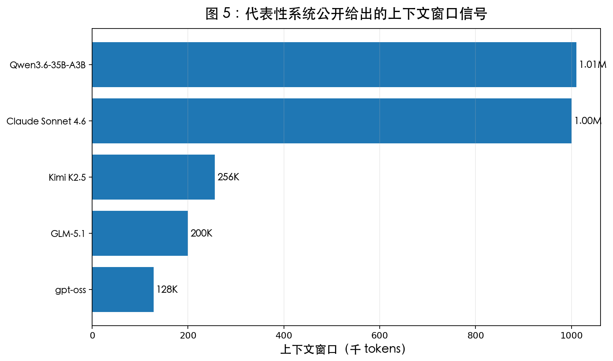
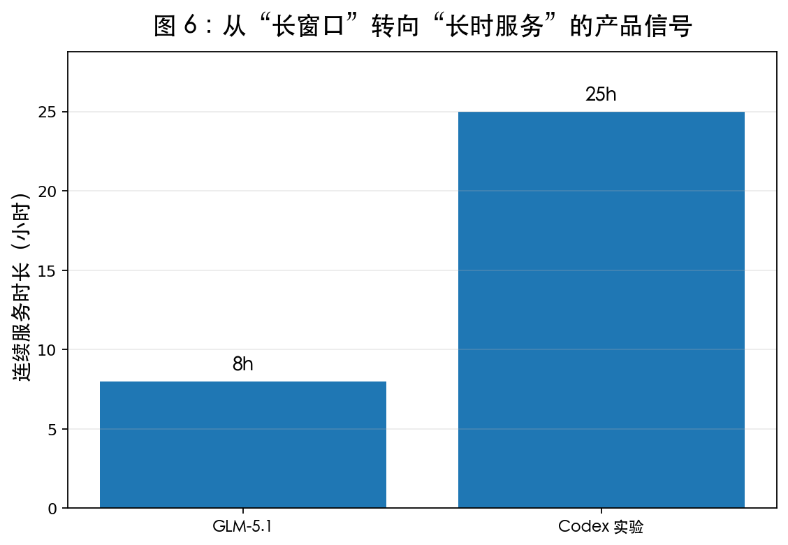
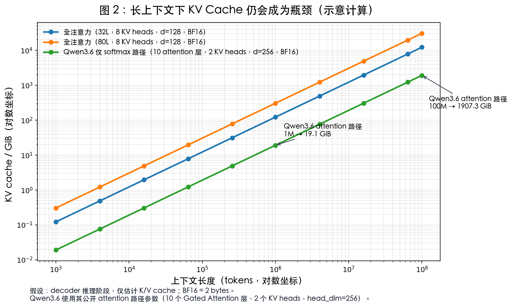
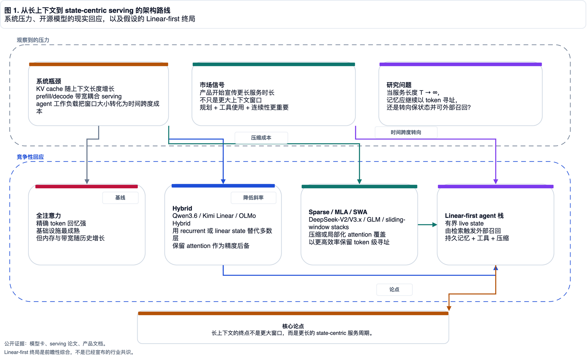
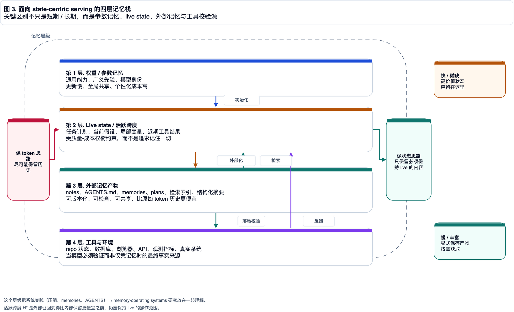
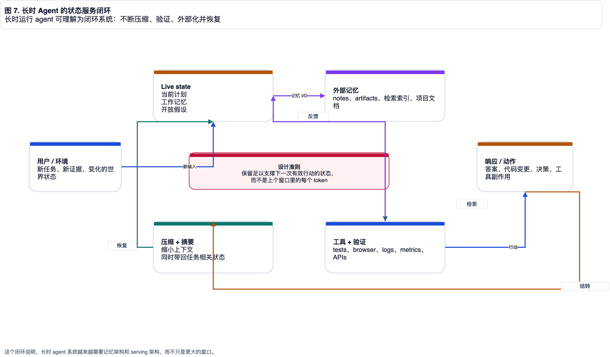
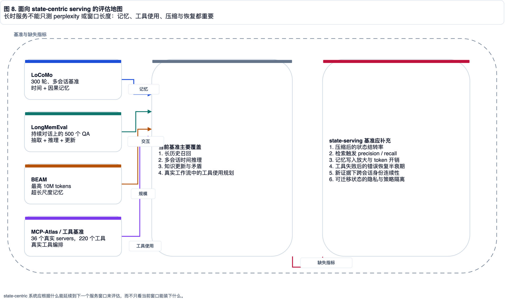
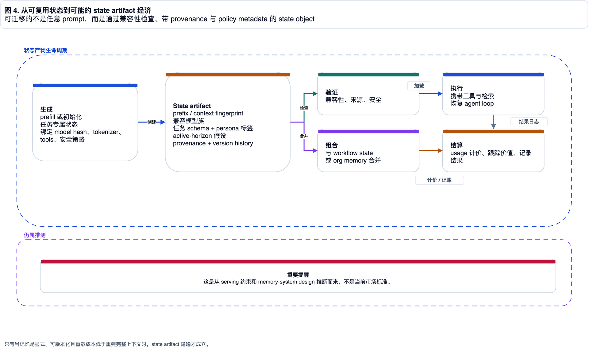

# 从超长上下文到终身服务

## 为什么开源模型最终会走向 State-Centric Serving

*一篇把架构分化、长时 Agent、外部记忆与状态资产化放在同一张系统图上的研究型博客草稿*  
*Review Draft · 2026-04-21*

> 状态说明：这是一份待审核长稿，暂不并入 `_posts/`。  
> 方法说明：文中尽量把“可由论文、模型卡、官方文档直接支持的事实”与“基于这些事实做出的系统推论”显式区分。  
> 图示说明：图 1、图 3、图 4、图 7、图 8 为本轮重绘；图 2、图 5、图 6 延续初稿中的定量图。

---

## 摘要

过去一年，长上下文赛道的竞争方式明显变了。

表面上看，行业还在比谁支持 128K、256K、1M，甚至更大的窗口。

但如果把模型卡、官方文档、工程博客和长时 Agent 的产品信号放在一起，真正正在被竞争的对象并不是单次请求里能塞下多少 token，而是模型能否在长时间尺度上维持稳定、连续、低成本的服务状态。

这正是本文的核心判断：

> **长上下文的终局，不是更大的窗口，而是更长的服务寿命。**

一旦问题从 `bigger window` 改写为 `longer service horizon`，系统设计的重心就会从“尽可能保留所有 token”转向“在可接受成本下保留足够的 live state，并在必要时通过外部记忆与工具召回高精度信息”。

在这个框架下，今天常见的 Hybrid、Sparse、MLA、SWA 等路线都仍然重要，但它们更像是过渡架构，而不是终局架构。

更像终局候选的，是一种 **Linear-first + External Memory + Tool-Grounded Verification** 的栈式系统。

全文按三段推进。

第一段先把问题从“窗口长度”改写成“服务时长”：为什么长上下文会变成 serving 问题，为什么 KV cache、prefill/decode 带宽和上下文残留会成为系统瓶颈。

第二段进入架构分化：Hybrid、Sparse / MLA / SWA 与 Pure Linear 分别解决什么，又为什么都必须放进更大的 state-centric serving 语法里理解。

第三段讨论系统化后果：四层记忆栈、state-serving evaluation、state artifact 的兼容性边界，以及 token 与 state 在未来服务经济中的不同角色。

---

## 0. 研究方法与问题定义

这篇文章不是单纯的技术综述，也不是完全自由的概念推演。

更准确地说，它试图回答一个介于模型架构、推理系统和 Agent 工程之间的问题：

> **当服务长度 \(T \to \infty\) 时，模型系统是否还能继续依赖 token-preserving memory？**

这里的 `T` 不是一轮请求的 token 数，而是一次任务在真实世界中持续运行的时间、轮次和上下文残留总和。

如果我们把模型放进 coding agent、research agent、workflow agent 这类长时系统里，那么它面对的并不是一段固定长度的 prompt，而是一条随时间生长、会被压缩、被外部化、被重新召回、并不断与环境交换状态的服务链路。

因此，本文中的 `state-centric serving` 指的不是一个已经被行业统一命名的标准范式，而是下述系统条件的组合：

1. 模型内部只保留高价值、可持续工作的 live state。
2. 超出 active horizon 的信息被显式外部化为 memory artifact。
3. 当内部状态不足时，系统通过 retrieval、tool use、document memory 和 verification 恢复高精度信息。
4. 服务系统必须支持 compaction、resume、carry-over、cross-session continuity，而不只是一次性完成推理。

为了避免把推论伪装成事实，下面先给一个简单的证据分层。

### 0.1 本文使用的证据层级

| 层级 | 含义 | 典型来源 | 在文中的处理方式 |
|---|---|---|---|
| A | 直接事实 | 模型卡、官方文档、论文中的明示数字 | 直接引用并用于论证 |
| B | 系统解释 | 从多个 A 级事实归纳出来的工程趋势 | 明确写成“本文判断” |
| C | 前瞻推演 | 对状态复用、状态资产化、计费与结算的未来结构猜测 | 明确标注为 speculative |

### 0.2 本文的中心命题

本文真正想证明的不是“某个模型比另一个模型更先进”。

它要证明的是下面这组三段论：

1. 长时 Agent 的兴起，使“服务连续性”成为比“窗口长度”更重要的竞争目标。
2. 一旦连续性成为主目标，token-addressable memory 的成本、带宽和治理负担就会被不断放大。
3. 因此，模型系统会逐步向“bounded live state + external recall + tool-grounded verification”的形态收敛。

---

## 1. 真正被竞争的对象：不是更大的窗口，而是更长的服务时长

很多关于长上下文的讨论，容易陷入一个过度静态的视角：

- 模型 A 支持 128K。
- 模型 B 支持 256K。
- 模型 C 支持 1M。

这样的比较当然重要，但它只描述了**单轮请求**的容量边界，并没有描述模型在长任务中的持续工作能力。

而今天真正有价值的 Agent 系统，越来越不是“一次答对一个问题”，而是在持续规划、多轮工具调用、跨窗口状态保留、证据更新和身份连续性之间保持稳定协同。

### 1.1 公开信号已经开始从“窗口”转向“服务时长”

下面这张表，把几个更有代表性的公开信号放在同一张坐标系里。

| 系统 / 来源 | 公开信号 | 对本文的含义 |
|---|---|---|
| Claude Sonnet 4.6（Anthropic） | 官方材料直接强调 1M token context，并把它与 codebase-scale reasoning 和 long-horizon planning 绑定 | 窗口不再只是容量指标，而是计划深度与任务持续性的接口 |
| Codex（OpenAI） | 官方长时任务博客披露：一次实验可连续运行约 25 小时、消耗约 13M tokens、生成约 3 万行代码 | 行业已经开始公开产品化“超长服务时长”，而不是只说上下文长度 |
| GLM-5.1（Z.AI） | 官方 overview 把 long-horizon agent / coding / browser automation 作为主场景，并给出 8 小时自主执行信号 | 长任务不是副作用，而是被直接写进产品定位 |
| Kimi K2.5（Moonshot） | 文档强调 256K context、long context 和 multi-step tool invocation | 窗口的意义被嵌入到 agent workflow 中 |
| Qwen3.6（Qwen Team） | 模型卡直接公开原生长上下文能力与 Hybrid 架构细节 | 模型结构已经在为长时服务做成本优化准备 |

换句话说，今天最重要的变化不是“更多 token 能被塞进一次前向传播”，而是：

> **模型被要求在更长时间里保持“任务没有死掉”。**

这比“能看到更多历史”更难，因为它同时要求：

1. 计划连续性。
2. 状态连续性。
3. 环境连续性。
4. 成本连续性。

这四个连续性其实对应四种完全不同的失败方式。

计划连续性失败时，模型并不是“不知道上下文里有东西”，而是忘了为什么自己要做当前动作。

状态连续性失败时，它可能还记得大目标，却丢掉了中间变量、约束、局部决策和未完成事项。

环境连续性失败时，它对真实世界的理解开始落后于仓库、浏览器、数据库或日志中的最新状态。

成本连续性失败时，系统看似仍然能工作，但每一步都要带着越来越重的历史负担，最终把 serving 成本推到不可持续。

所以，长时服务不是“把更长聊天记录塞进去”这么简单。

它更像让一个工程师连续值班十几个小时，期间不断交接任务、读取日志、修改代码、运行测试、修正假设，同时还要留下足够清楚的工作记录，保证下一轮醒来时不是重新从零开始。

### 1.2 窗口长度只是服务长度的一个局部投影

从系统角度看，窗口长度只是以下问题的局部投影：

- 在多久之后，早期信息会从 live context 中被挤出？
- 在上下文被压缩后，系统是否还能恢复关键状态？
- 外部 memory artifact 是否足够结构化，以支持可靠 resume？
- 工具调用结果是否会被持续积累，而不是每轮都重新推导？

因此，把“1M context”直接等同于“终身记忆”，本身就是一个概念误配。

一个最直观的例子是 coding agent。

一个大型代码库也许能被塞进 1M token 窗口，但真实工程任务很少只是“读完代码库然后回答问题”。

它更像一条工程流水线：需求理解 -> 模块定位 -> 修改文件 -> 运行测试 -> 读取失败日志 -> 修正实现 -> 记录已尝试路径 -> 生成 PR 或交接说明。

这里真正需要被保留下来的，未必是最早那一百万 token 的原文，而是“哪些假设已经被证伪”“哪些测试失败过”“当前 diff 的语义是什么”“哪些风险还没有验证”。

这些对象更接近 state，而不是 raw context。

图 5 和图 6 之所以重要，不是因为它们告诉我们哪个数字更大，而是因为它们把两个不同的轴分开了：

*图 5. 长上下文的公开信号仍然重要，但它只是服务系统的一部分接口。数据来自模型卡与官方文档。*

*图 6. 更值得关注的变化，是长任务被显式产品化：规划、连续执行、工具使用与长时交付正在进入主流叙述。*

### 1.3 一个更准确的问题表述

基于以上观察，本文后续不再把问题写成：

> 谁能做出更大的 context window？

而是改写成：

> **谁能在更长的服务时长内，以更可控的常驻记忆成本，保持更稳定的工作状态？**

只要这样一改写，注意力就会从“窗口竞赛”转向“状态管理”。

---

## 2. 为什么超长上下文最终会变成一个 serving 问题

长上下文当然涉及模型架构，但它在实践中首先是一件 serving 的事。

因为一旦上下文非常长，模型系统面对的核心约束几乎都来自推理期：KV cache 会随历史线性增长，prefill/decode 带宽会被长历史拖住，prefix reuse 与 cache matching 变得更复杂，多租户场景下的显存和吞吐预算也会被持续拉扯。更麻烦的是，长时 Agent 产生的“中间状态残留”已经不再等同于简单文本历史。

### 2.1 一个粗略但足够说明问题的 KV cache 公式

对于 decoder-only 模型，推理阶段的 KV cache 可以粗略写成：

`KV bytes ≈ T × L × H_kv × d_head × 2 × bytes_per_elem`

其中，`T` 是缓存的 token 数，`L` 是 attention 层数，`H_kv` 是 KV 头数，`d_head` 是单头维度；公式里的 `2` 对应 K 和 V 两份缓存，`bytes_per_elem` 在 BF16 下通常是 2。

这个公式不复杂，但它已经说明了一件关键事实：

> **只要系统仍然依赖长度相关的 token cache，服务成本就会随着历史增长而持续膨胀。**

这里需要强调一点：KV cache 不是“静静躺在显存里的历史文本”。

它是 decode 阶段持续被访问、被搬运、被调度的运行时对象。

当上下文很短时，KV cache 像一份方便的工作台笔记。

当上下文变成几十万、上百万 token 时，它就更像一条越来越长的供应链：每个新 token 的生成，都要在这条供应链上继续完成匹配、读取和带宽调度。

这也是为什么长上下文经常不是单纯的容量问题，而是显存、HBM 带宽、batching、prefix reuse、cache eviction、跨节点传输一起参与的系统问题。

这也是为什么很多长上下文优化，从根上看其实都不是在“解决记忆问题”，而是在：

- 推迟爆炸点。
- 降低爆炸斜率。
- 把部分长度相关缓存改造成长度无关状态。

### 2.2 图 2 想说明的不是“谁的曲线更漂亮”

初稿中的图 2 仍然保留，因为它很好地说明了一个工程直觉：

*图 2. 即便只保留少量 attention 层，长度相关的 cache 压力依然会随着上下文增长持续放大。*

这张图真正要强调的是：

- 如果 attention 层依然存在，那么长度相关成本依然存在。
- 如果服务要持续数小时乃至更久，历史长度就不仅是上下文问题，而是资源调度问题。
- 如果任务中存在工具调用、文件修改、日志回读、网页浏览等动作，那么“应该带着什么继续运行”比“应该把哪些 token 原样带上”更重要。

### 2.3 Serving 文献中的一个关键信号：状态正在被拆分

Moonshot 的 Prefill-as-a-Service 论文对本文很重要，不是因为它直接提出了“state market”，而是因为它把下一代长上下文 serving 面对的内存对象区分得更清楚了。

这类工作至少给出三个值得注意的信号：

1. 长历史不再只是单机显存问题，而是可能演化成跨节点、跨数据中心的服务编排问题。
2. 在 Hybrid 架构里，部分层的 recurrent state 与输入长度无关，这说明系统已经开始主动偏好 bounded state。
3. 一旦服务系统需要频繁 transport、reuse、resume 和记账，memory object 的边界就会变得越来越明确。

这也是为什么本文认为，长上下文的下一阶段不会只是更激进的 attention kernel，而是更像一套 memory-serving protocol。

从 Agent 工作负载看，这个判断会更明显。

如果只是一次问答，历史大致可以被看成输入。

但如果是长时服务，历史会不断被改写成不同形态。它有时留在当前上下文里，有时变成摘要或外部文件，有时沉淀为工具调用结果和测试日志，有时甚至只是一个负例经验：不要再走这条路。

这些对象的生命周期、访问频率、校验方式和隐私属性都不一样。

把它们都叫作 context，会掩盖系统设计中最关键的区别。

### 2.4 基础设施成熟度本身也在改变架构选择

MiniMax 关于 M2 的复盘同样值得重视。

那篇材料的价值在于，它没有简单重复“线性 attention 更省”这种抽象口号，而是把问题拉回到工业 serving 的落地面：prefix caching、low-precision state、speculative decoding、infra 稳定性和训练收益是否足以覆盖系统复杂度，这些才是真正决定架构能否落地的因素。

这说明一个经常被忽略的事实：

> **架构的范式优雅性，并不会自动转化成 serving 系统的工业优越性。**

所以本文后面会不断区分两种“更优”：

- **今天更容易训成强模型的更优。**
- **明天更可能成为长时服务底座的更优。**

---

## 3. 开源模型为什么分裂成了 Hybrid、Sparse 与 Linear-first 的想象空间

长上下文带来的压力并不会自动收敛成唯一答案。

它反而把开源模型推向了几种不同的现实路线。

### 3.1 一个更有用的路线图

图 1 是本文对当前路线的压缩总结。

*图 1. 这张图有意把“已观察到的工程响应”和“本文的前瞻性判断”分开，以避免把推演写成既成事实。*

### 3.2 三条常见路线各自在解决什么

| 路线 | 直接目标 | 代表信号 | 真正解决的问题 | 没有解决的问题 |
|---|---|---|---|---|
| Full Attention | 保留精确 token-to-token 召回 | 传统 Transformer 与一部分高性能工业系统 | 高保真 recall、成熟 infra | 历史越长，KV cache 与带宽压力越大 |
| Hybrid | 用 bounded recurrent / linear state 替代大部分 attention 层 | Qwen3.6、Kimi Linear、OLMo Hybrid | 把大部分长度相关缓存改成长度无关状态 | 仍需 attention 层承担精确检索与兜底 |
| Sparse / MLA / SWA | 保留 token-addressable memory，但降低覆盖成本 | DeepSeek-V2/V3.x、GLM 系列、滑窗系统 | 在 recall 与成本之间取得较好平衡 | 记忆仍然主要以 token 形式被维护 |

这三条路线里，今天最容易被误解的其实是 Hybrid。

更好的理解方式，是把它们放在两个轴上看。

第一条轴是 **recall fidelity**：系统在多大程度上保留精确 token 位置与 token-to-token 交互。

第二条轴是 **state compactness**：系统在多大程度上愿意把历史压缩成一个更小、更难反查、但更便宜的状态。

Full Attention 位于 recall fidelity 的极端。

Pure Linear 位于 state compactness 的极端。

Hybrid 和 Sparse 则分别从两侧向中间靠拢：前者优先压缩多数层的状态，后者优先保住 token-addressability 的可用性。

很多讨论把 Hybrid 看成“Pure Linear 的半成品”，这并不准确。

它更像是在承认下面这个现实：

> 目前最稳妥的做法，是把“状态跟踪”和“精确召回”拆成不同层来做。

### 3.3 三个代表性案例

#### Qwen3.6：公开地把 attention 留在少数层

Qwen3.6 的模型卡之所以重要，不只是因为它给出了长上下文数字，更因为它直接公开了一个对本文判断很关键的结构事实：

- 40 层里只有一部分是 Gated Attention。
- 其余多数层已经转向 Gated DeltaNet 一类的线性状态更新。
- 原生上下文能力已经达到 262,144，并可扩展到更高区间。

这等于在公开模型卡层面承认：

> **为了长时服务，系统已经愿意牺牲“所有层都能做 full attention”的统一性。**

这背后的工程含义很强。

如果一个模型仍然把所有层都设计成 full attention，那么每一层都天然携带长度相关的运行时负担。

而 Qwen3.6 这类结构的选择，等于在模型内部做了一次显式分工：少数层负责更接近精确召回的功能，多数层负责状态更新和压缩。

这不是一个“细节参数”，而是模型系统对长上下文成本压力的结构性回应。

#### Kimi Linear：把 Hybrid 的 serving 收益写得更直接

Moonshot 的 `Kimi Linear` 仓库给出的信息同样关键。

它明确写到：

- 使用 3:1 的 KDA-to-MLA 配比。
- 支持 1M 上下文。
- 在 certain settings 下，KV cache 可减少 75%。
- 长序列 decode 可获得更高吞吐。

这说明 Hybrid 的价值不仅仅是“理论上省”，而是已经被直接包装成推理收益。

这对博客读者尤其重要。

因为很多架构讨论会停留在复杂度符号上，例如 `O(n^2)` 与 `O(n)` 的对比。

但真正让一条路线进入工业系统的，不是复杂度符号本身，而是它能否转化成 decode 吞吐、显存占用、cache 命中率、部署稳定性和多租户成本。

Kimi Linear 的公开叙述之所以值得引用，正是因为它把架构变化和 serving 收益直接连接起来。

#### DeepSeek-V2：MLA 证明“压缩 token-addressable memory”同样强势

DeepSeek-V2 论文对另一条路线给出强有力支持。

它用 Multi-head Latent Attention 去压缩 K/V 表示，并报告相对于 DeepSeek 67B 可实现 93.3% 的 KV cache 降低。

这条路线的含义是：

- 不一定要立刻放弃 token-addressable recall。
- 也可以先把 token memory 压缩到工程上可接受的区间。
- 对于很多今天的任务，这种折中依旧非常有竞争力。

从产品角度看，这也解释了为什么 Sparse / MLA 路线短期内非常有生命力。

很多任务并不需要终身服务，却非常需要精确引用、精确代码定位、精确长文档问答和稳定工具调用。

在这些任务里，过早抛弃 token-addressability 可能会损失太多可解释性和召回稳定性。

所以，Sparse / MLA 并不是“保守落后”，而是对当前任务分布的理性回应。

### 3.4 OLMo Hybrid 给出的反证：过渡架构不等于弱架构

AllenAI 的 OLMo Hybrid 给本文提供了一个非常重要的“反证”。

如果它只是“显存更省但能力稍差”的临时方案，那它对未来判断的价值会比较有限。

但公开材料显示，OLMo Hybrid 不仅长上下文表现更稳，在某些设定下还可以用更少的 token 达到与对照模型相同的 MMLU 水平，并在 RULER 上取得更好表现。

这件事迫使我们承认：

> **更接近终局，不一定意味着在今天更强；反过来也一样，今天更强，不等于已经接近终局。**

---

## 4. 为什么说 Hybrid 与 Sparse 仍然更像过渡形态

如果只看 2026 年眼下的工程现实，Hybrid 和 Sparse 都很强。

但本文之所以仍然把它们看作过渡路线，不是因为它们“不好”，而是因为它们都还没有完成同一个更深层的迁移：

> **从 token-preserving memory 迁移到 state-preserving memory。**

### 4.1 Hybrid 真正做成的事情：把多数层改造成长度无关状态

Hybrid 最重要的结构意义，是把大量层从“长度相关缓存”改造成“长度无关状态”。

这件事非常关键，因为它第一次把模型内部的记忆对象分裂成两种：

1. 仍然与历史长度线性相关的 token cache。
2. 与长度基本无关、但与请求状态相关的 recurrent state。

从 serving 视角看，这已经不是单纯的 attention 变体，而是 memory object 的重构。

### 4.2 Sparse / MLA 真正做成的事情：保住 token-addressability，但把成本压下去

Sparse、MLA、SWA 一类系统的结构意义则不同。

它们没有强行把世界从 token memory 改造成 state memory。

它们做的，是尽量保住 token 级精确召回，同时把覆盖范围、头部表示、滑动窗口、block reuse 和局部性这些因素工程化到一个更可接受的成本点上。

所以，这条路线的哲学并不是“我不需要 token memory”，而是：

> **我仍然需要 token memory，但我要让它更便宜。**

### 4.3 为什么这两条路线都还不是终局

只要任务长度继续上升到更极端的区间，例如：

- 10M token 等级的超长交互历史；
- 跨多日的 coding agent；
- 面向组织知识与团队工作流的记忆系统；
- 需要多次压缩、摘要、恢复与验证的服务链路；

那么下面几个问题都会重新冒出来：

1. 哪些历史需要一直保持 token-addressable？
2. 哪些状态应该被提炼成更小的 live state？
3. 哪些信息应该被显式写入外部 memory artifact？
4. 哪些外部对象需要被看成“比自然语言更稳定”的可恢复状态？

只要这几个问题不能回避，系统就迟早要进入一个新阶段：

> **模型不再围绕“保存全部历史”设计，而是围绕“保存足够继续工作”的状态设计。**

这里可以用一个具体场景来说明。

假设一个 coding agent 已经连续工作 6 小时。

它读过上百个文件，跑过几十次测试，尝试过三条错误修复路径，留下了一个中等规模 diff，并且发现某个 flaky test 与当前改动无关。

如果我们把全部历史原样保留，成本会很高，而且很多 token 对下一步没有边际价值。

如果我们只保留一段摘要，模型可能丢掉关键细节，例如“哪个失败是无关的”“哪个 mock 不能改”“哪个 API contract 已经被确认过”。

真正合理的做法，是把状态分层处理：当前 diff 和未解决错误留在 live state；失败路径写入外部 notes；测试日志与代码库状态保存在可检索、可验证的 artifact 中；如果后续需要，再用工具重新验证，而不是相信记忆。

这就是 state-centric serving 的具体含义。

### 4.4 一个更精确的结论

所以，本文并不主张“Hybrid 很快会被抛弃”。

更准确的说法是：

- **Hybrid 很可能仍是未来几年最务实的强模型路线之一。**
- **Sparse / MLA 仍会是高性能 serving 的主力组件。**
- **但当服务寿命继续增长时，系统组织方式会越来越 state-centric。**

这就是“过渡”的真实含义。

它不是“马上淘汰”，而是“最终要被纳入一个更大的系统语法里解释”。

---

## 5. Pure Linear 为什么更像终局候选，但也更难

如果我们接受上一节的结论，那么下一步几乎自然会问：

> 那为什么不继续往前，把剩下的 attention 层也拿掉？

这个问题很自然，但也最容易误导。

### 5.1 Pure Linear 不是“继续做减法”就会自动出现

直觉上，人们容易把 Hybrid 看成一条单调连续的路径：

`Full Attention -> Hybrid -> Less Hybrid -> Pure Linear`

但训练出来的模型不是这样工作的。

一旦模型在预训练阶段已经形成了某种层间分工，那么“剩余的 attention 层”并不只是没来得及删掉的包袱。

它们往往承担着：

- 长程精确检索；
- 高保真重定位；
- 复杂对齐与重组合；
- 与其他层分工后的召回兜底。

这也是为什么 HALO 这类蒸馏工作会专门设计 attention layer selection。

那其实是在说：

> **不是所有 attention 层都等价，也不是所有 attention 层都能被无痛替换。**

### 5.2 RADLADS 与 HALO 证明的是“可以转”，不是“终局可轻松转”

RADLADS 证明，从一个 softmax-attention teacher 快速蒸馏出 linear decoder 是可能的。

HALO 进一步说明，把 Transformer 蒸馏进 Hybrid 也可以是有效路径。

这些结果都很积极。

但它们证明的，是：

- 后处理式转换可行；
- distillation curriculum 可以显著减少额外训练量；
- 线性或混合架构未必是完全独立的一条训练路线；

它们并没有证明：

> 未来最强的 pure linear frontier model 可以靠“后面再改一改”轻松得到。

这两者差别很大。

### 5.3 真正困难的地方其实是数据工程

本文在这一点上的判断非常明确：

> **如果 Pure Linear 真的要成为长时服务底座，最大难点大概率不是算子本身，而是数据工程。**

原因在于，线性状态模型如果只是学会“更省内存地预测下一个 token”，它仍然不等于学会了长时 Agent 所需的记忆行为。

它还必须学会三类更接近 Agent 行为的能力：哪些信息留在 live state，哪些信息写入外部记忆，什么时候触发 retrieval、tool verification 或 compaction 后的任务恢复。

这些能力都不是单靠注意力替换就会自动长出来的。

因此，真正需要的数据不是“更长的普通文本”而已。

更理想的数据可以分成三类。第一类是流式任务执行记录，包括中途状态压缩和延迟很久之后才被询问的细节；第二类是恢复型数据，包括工具失败后的修复过程和文档化的中间决策；第三类是记忆选择数据，包括被主动遗忘或降级的无关历史，以及检索成功与检索失败的对照样本。

换句话说，训练数据要让模型看到一种行为模式：

> 有些东西必须记在脑内，有些东西必须写到纸上，有些东西必须重新查证，有些东西应该果断忘掉。

这比“给模型看一本更长的书”要难得多。

### 5.4 Active Horizon：Pure Linear 的目标也不是“无限内部记忆”

这里还要特别澄清一个常见误解。

把未来说成 state-centric，并不等于说未来模型会拥有“无限内部记忆”。

恰恰相反，线性状态模型真正追求的，很可能是一个经过优化的 **active horizon \(H^\*\)**：

`H* = argmin(状态维护成本 + 外部检索成本 + 遗忘损失)`

这个公式不是现成论文里的正式定义，而是本文用来表达系统权衡的工程化写法。

它的含义是：

- 如果内部保留太多状态，成本会升高；
- 如果外部检索太频繁，吞吐与稳定性会下降；
- 如果压缩过度，遗忘损失会直接打击任务质量；

所以真正重要的，不是“无限记住一切”，而是：

> **在不频繁崩掉服务质量的前提下，保留尽可能小但足够强的活跃状态。**

---

## 6. 一个更像“记忆操作系统”的系统图景

只要接受 `active horizon` 这个概念，一个新的图景就会自然出现。

长时 Agent 不是靠单个巨大上下文在工作。

它更像靠一套分层记忆系统在工作。

### 6.1 四层记忆栈

图 3 给出了本文使用的四层记忆栈。

*图 3. 这张图刻意把 parameter memory、live state、external memory artifact 和 tool-ground truth 分开。因为在长时服务里，这四者的更新频率、成本、可审计性和治理方式完全不同。*

这四层分别对应：

1. **Weights / Parameter Memory**  
   存储广义能力、普遍先验、模型身份。

2. **Live State / Active Horizon**  
   存储当前计划、局部变量、近期观察、短期任务身份。

3. **External Memory Artifacts**  
   存储摘要、计划、显式说明书、Memory 文件、向量索引、组织知识与工作流状态。

4. **Tools & Environment**  
   存储最终真值：代码、数据库、浏览器、日志、指标、API、真实系统。

可以把这四层想象成一位研究员的工作方式。

模型参数像长期教育背景，决定它会不会读论文、会不会写代码、会不会理解统计图。

Live state 像它此刻桌面上摊开的草稿纸，记录当前假设、下一步要验证什么、刚刚哪条路失败了。

External memory artifact 像实验笔记、项目文档、引用管理器和待办清单，它不一定每秒都在脑中，却能稳定保存可追溯的过程。

Tools & Environment 则像实验仪器和真实数据表：当笔记和记忆出现冲突时，最终要回到这里重新测量。

长时 Agent 的很多错误，恰恰来自把这些层混在一起：把模型自信当成仪器读数，把摘要当成日志，把 prompt 当成项目记忆。

### 6.2 为什么这比“短期记忆 / 长期记忆”更有用

很多关于 Agent 记忆的讨论，喜欢只分成：

- 短期记忆；
- 长期记忆。

这在科普文章里足够，但在真实服务系统里不够。

因为它忽略了两个关键区别：

1. **参数记忆和运行时状态不是一回事。**
2. **外部记忆和工具真值层也不是一回事。**

例如：

- `AGENTS.md`、`MEMORY.md`、计划文件、project notes 都属于 external artifact。
- 但 repo 当前的测试结果、浏览器里的页面、数据库中的真实状态，并不属于“记忆”，它们属于 environment truth。

这个区分非常重要。

因为一个系统如果把二者混为一谈，就会开始用摘要替代验证，用记忆替代真相。

### 6.3 官方工程实践已经在往这个方向走

Anthropic 与 OpenAI 在 agent 文档里给出的实践，实际上已经越来越接近这种四层栈。

例如：

- `AGENTS.md` 被显式当作工作指令层。
- `memories` 被当作稳定偏好与工作流知识的外部化载体。
- `compaction` 被当作跨长对话保持状态连续性的必要机制。
- 技能、文档、工具、日志与环境状态则按需加载，而不是一开始全部塞进 prompt。

这说明外部记忆并不是“模型不够聪明的补丁”，而是在长时服务里被主动制度化的一层。

### 6.4 研究论文也开始把模型看成“记忆操作系统”

这也是为什么本文认为 MemGPT、A-MEM、D-MEM、MemOS、MemX 这一类工作非常关键。

它们虽然路线各不相同，但共同指向一件事：

> **未来的 Agent 记忆管理，不会只是“把更多东西塞进 prompt”，而会越来越像一个有写入策略、有分层、有调度、有回收机制的 memory OS。**

下面这张图，把这种动态再压缩一步。

*图 7. 一次长时服务循环里，真正被反复操作的对象并不是纯文本历史，而是 live state、摘要、外部记忆、工具反馈和 carry-over residue。*

### 6.5 一个重要结论：Markdown memory 不是“外挂”，而是脑外存

把 `AGENTS.md`、`memories`、project notes、plans、retrieval index、skills 等对象看作系统外部的一层脑外存，会比把它们看作“Prompt 工程技巧”更准确。

因为对长时服务来说，真正有价值的，不是“更漂亮的一次 prompt”，而是：

- 更可靠的状态外部化；
- 更便宜的状态恢复；
- 更清楚的可审计性；
- 更明确的治理边界。

这也是博客里最应该强调的实践含义。

如果一个团队想让 Agent 长期参与工程工作，最先需要建设的可能不是更复杂的 prompt 模板，而是一套记忆治理规则：哪些决策必须写入持久文件，哪些中间结果可以丢弃，哪些工具结果必须被重新验证，哪些记忆可以跨任务共享，哪些记忆必须局限在当前任务，以及哪些状态在任务结束后必须删除。

这些问题听起来不像“模型能力”，但它们会直接决定模型能力能否稳定落地。

---

## 7. 如果要认真评估 state-centric serving，我们该测什么

只要问题从 long context 转向 long service，评估就必须跟着变。

过去很多 benchmark 主要测：

- 长文本 recall；
- 长对话问答；
- 多跳推理；
- 滑动窗口下的性能退化；

这些仍然重要，但它们已经不够。

### 7.1 长上下文 benchmark 的价值与边界

LoCoMo、LongMemEval、BEAM 这类工作都非常有价值。

它们至少把三件事带进了评估框架：

1. 对多轮、多时段、多事件的记忆保持。
2. 对知识更新、冲突与时间顺序的处理。
3. 对超长对话或超长历史下记忆行为的测量。

但如果系统本身已经开始依赖 compaction、external memory artifact、retrieval trigger、工具调用与验证、session resume，那么只测“窗口内 recall”就会漏掉最关键的一半。

### 7.2 图 8：从 long-context eval 到 state-serving eval

*图 8. 一旦系统被当作长时服务系统来构造，它就必须被问：哪些能力在 compaction 之后还能留存？哪些错误在 tool failure 后能恢复？哪些记忆写入只是 token 浪费？*

### 7.3 本文建议新增的六类指标

下面这六类指标，不一定都能立刻标准化，但我认为它们是 state-centric serving 迟早会需要的。

#### 1. State carry-over rate

定义：

- 经历一次或多次 compaction 后；
- 系统仍能恢复多少关键任务状态；
- 并继续产出正确的下一步动作。

这比单次 recall 更重要，因为它衡量的是服务连续性。

例如，一个 agent 在上下文压缩前知道“当前失败来自旧测试基线，不是本次 diff”，压缩后是否仍然知道？

如果它忘掉了这个判断，就可能重新浪费半小时追一个无关错误。

这类损失不会被普通 long-context recall 完整捕捉，但会直接影响长时服务效率。

#### 2. Retrieval-trigger precision / recall

不是所有缺失信息都值得触发检索。

一个成熟系统需要回答：

- 什么时候该查？
- 查到了以后是否真的改善了动作质量？
- 是否存在“明明该查却不查”的失误？

#### 3. Memory write amplification

如果系统每完成一点点工作就写大量摘要、日志和冗余状态，那么它虽然“看起来有记忆”，但实际上是在用 token 与 I/O 堆砌假连续性。

因此需要测量：

- 单位有效进展对应多少记忆写入；
- 多少写入是真正被后续恢复使用的；
- 多少写入只是昂贵的噪声。

这项指标尤其适合区分“认真做 memory engineering”和“把所有东西都写进 markdown”的差别。

后者短期看起来可靠，但长期会制造另一种形式的垃圾上下文：文档越来越多、质量越来越低、检索越来越不准。

#### 4. Error-recovery half-life

当工具失败、摘要失真、外部 memory 被污染、或计划偏航时，系统需要多久才能重新回到正确轨道？

这比一次性准确率更接近真实服务系统的韧性。

#### 5. Cross-session identity continuity

一个长时 Agent 最怕的不是单轮答错，而是“醒来之后不再是同一个任务中的自己”。

所以需要测：

- 在会话切换之后，它是否仍保留目标、约束和局部计划；
- 当新证据推翻旧结论时，它是否能更新身份，而不是死守旧摘要。

#### 6. Portable-state privacy isolation

如果未来真的出现可移植 state artifact，那么：

- 状态里混入了哪些敏感信息？
- 不同组织的 policy 是否可隔离？
- persona state 能否被审计与吊销？

这些都必须进入评估，而不是等市场化之后再补课。

### 7.4 为什么 MCP-Atlas 也应该进入这篇文章

MCP-Atlas 之类的基准和 long-context benchmark 看起来不是一个题目。

但本文认为它们必须被放在一起看。

原因很简单：

> **长时服务的目标从来不是“记住得更久”本身，而是“在记住得足够久的同时，做对更多真实动作”。**

如果一个系统在长历史下记忆很好，但不会调用工具、不会恢复环境、不会验证结果，那么它仍然不是强的 state-serving system。

---

## 8. 从缓存到资产：state artifact 会不会成为中间层

这一节是本文最前瞻、也最需要谨慎措辞的一部分。

我的判断不是“state market 已经存在”，而是：

> **如果 state-centric serving 成为主流，那么某种形式的 state artifact 迟早会出现。**

### 8.1 为什么“卖 prompt”不是本文真正讨论的对象

很多人一听到“状态市场”，第一反应是：

- prompt marketplace；
- 角色 prompt；
- 可复用系统提示词；
- persona pack；

但这些对象太松散。

它们通常缺少三类关键约束：第一类是兼容性边界和版本绑定，第二类是工具 schema 与安全策略绑定，第三类是 provenance、可恢复性与可验证性。

因此，真正更可能变成中间资产的，并不是任意 prompt，而是：

> **带兼容性元数据、可验证 provenance、可恢复执行语义的 state artifact。**

### 8.2 图 4：最小生命周期

*图 4. 图中“Settle”与“artifact economy”都属于本文的前瞻推演，而不是已存在的行业标准。*

### 8.3 一个 state artifact 至少要绑定什么

如果未来要讨论 portable state，一个最小兼容集合可以分成三组。

| 兼容组 | 需要绑定的元数据 | 作用 |
|---|---|---|
| 模型与运行时 | model family / model hash、tokenizer version、active-horizon assumptions | 判断这个状态能不能被当前模型正确恢复 |
| 任务与环境 | system policy、safety policy、tool schema、environment assumptions | 判断状态是否适配当前任务边界和工具边界 |
| 来源与治理 | state provenance、persona / workflow tag、组织级 ACL 与撤销机制 | 判断状态是否可信、可审计、可控制 |

没有这些元数据，所谓“状态复用”大概率只是一种脆弱的 prompt 拼接。

一个类比是软件包。

我们不会只上传一段代码文本，然后声称它可以在任何环境里运行。

一个可靠的软件包至少要说明版本、依赖、入口、权限、运行环境和兼容范围。

state artifact 也类似。

如果它不绑定模型版本、tokenizer、工具 schema 和安全策略，那么“加载状态”就像把一个未知平台的二进制文件直接塞进生产环境。

它也许能跑，但你很难知道它为什么能跑，更难知道什么时候会坏。

### 8.4 为什么这件事和 serving 直接相关

如果状态要经历 `mint -> serialize -> cache -> resume -> transfer -> audit -> account` 这一整条生命周期，那么它就不再只是模型内部的隐含对象，而会越来越像 serving 协议中的显式对象。

这也正是本文所谓“从缓存到资产”的真正含义。

### 8.5 这里有哪些必须明说的限制

为了避免把这一节写成 techno-fantasy，我想明确列出三个限制。

#### 限制 1：状态兼容性可能极其脆弱

模型版本变了、tokenizer 变了、policy 变了、tool schema 变了，原状态是否还能恢复，未必成立。

这意味着 state artifact 不一定像普通文件那样可长期保存。

它更可能像一个强绑定运行时的 checkpoint：有价值，但可移植性并不天然成立。

#### 限制 2：个人化状态天然携带治理风险

越接近高价值 persona，越可能包含隐私、组织流程、敏感偏好与隐性策略。

如果一个“律师 state”或“量化研究员 state”真的有价值，那么它几乎必然包含大量不能随意外流的工作习惯、内部流程和隐性知识。

这会让 state market 的治理问题比 prompt market 严重得多。

#### 限制 3：市场不一定先出现，内部平台可能先出现

比起开放状态市场，更现实的先行形态可能是：

- 企业内状态仓库；
- 组织级 workflow state registry；
- agent platform 内部的 state resume system；
- 与 billing/observability 绑定的私有 state ledger。

### 8.6 一个谨慎的结论

因此，本文愿意保留下面这句判断，但会明确标注为前瞻推演：

> **如果 token 承担流量与即时结算，那么 state 更可能承担沉淀、复用和中间资产化。**

---

## 9. 反对意见、边界与可能失败的地方

到这里，最合理的态度不是“本文已经证明未来必然如此”，而是主动列出反对意见。

### 9.1 反对意见一：Full Attention 也许仍会长期占优

这是最强的反对意见之一。

理由包括：

- infra 更成熟；
- 训练配方更稳定；
- token-level recall 仍然是大量任务的最佳接口；
- 即便成本高，工程优化与硬件迭代也可能继续延缓架构切换。

本文接受这个反对意见的一半。

也就是说：

- **Full Attention 在相当长时间内仍会继续强势存在。**
- **但长时服务系统会越来越需要 state-centric 组织方式。**

这两个判断并不矛盾。

### 9.2 反对意见二：外部记忆会让系统过度复杂

确实如此。

增加 external memory、compaction、retrieval、tool verification 之后，系统复杂度会明显上升。

但问题在于，复杂度并不会因为你拒绝显式建模它就消失。

你不把状态显式建模，它就会以另一种更危险的形式回来：

- 漫长而不可控的 prompt 历史；
- 无法审计的摘要；
- 会话切换后的身份漂移；
- 低可恢复性的任务残留。

### 9.3 反对意见三：所谓 state artifact 很可能只是企业内部缓存

我认为这个反对意见非常合理。

而且即便它是对的，也不影响本文的中心论点。

因为本文真正要说的不是“明天就会有开放状态交易所”，而是：

> **状态对象会越来越显式、越来越可管理、越来越成为 serving 的一级对象。**

它先表现为缓存，还是先表现为平台内部 resume artifact，并不改变方向本身。

### 9.4 反对意见四：长时 Agent 的评估还远不成熟

完全同意。

这也是为什么本文专门加入第 7 节。

如果没有更好的 benchmark，我们很容易把：

- 长上下文回忆；
- 提示词工程；
- 工具成功率；
- 系统韧性；

这些本该区分的能力混成一个模糊指标。

---

## 10. 结论：大模型的下一阶段，更像长时服务系统，而不只是更长上下文模型

如果把全文压缩成最核心的五个判断，我会保留下面这些。

### 判断 1

**长上下文的竞争主轴，正在从“单轮容量”转向“服务连续性”。**

### 判断 2

**只要服务时长继续增加，KV cache、prefill 带宽、resume、compaction 与 retrieval 就会越来越成为一等系统问题。**

### 判断 3

**Hybrid 与 Sparse 不是错误路线，恰恰相反，它们是当前最强的现实路线；但从更长时尺度看，它们仍更像通往 state-centric serving 的过渡形态。**

### 判断 4

**如果 Pure Linear 要成为真正的终局候选，它不能只靠后期替换 attention，而必须在数据工程、外部记忆、tool use 与 active horizon 的训练目标上原生设计。**

### 判断 5

**一旦 memory 的重心从 token 转向 state，模型系统就会越来越像一个“可外部化、可压缩、可恢复、可审计”的记忆操作系统。**

所以，本文最终想给出的不是一句耸动口号，而是一句更准确的系统判断：

> **下一阶段的大模型，不会只是“上下文更长的 Transformer”，而会是“围绕状态连续性构造的长时服务系统”。**

---

## 附录 A：文中使用的两个工程化公式

### A.1 KV cache 的粗略估算

`KV bytes ≈ T × L × H_kv × d_head × 2 × bytes_per_elem`

含义见第 2 节。

它不是为了给出某个模型的精确显存，而是为了说明：

- 只要保留长度相关缓存；
- 随着历史增长；
- 推理期成本就会持续累积。

### A.2 Active Horizon 的直觉形式

`H* = argmin(状态维护成本 + 外部检索成本 + 遗忘损失)`

它不是现成论文中的定义，而是本文对长期服务系统权衡的工程化表达。

---

## 附录 B：建议保留到正式版中的图表

如果后续并入 blog 模块，我建议至少保留以下图表：

1. 图 1：路线图  
   用来在开头直接建立全文 thesis。

2. 图 2：KV cache 曲线  
   用来把抽象争论落到资源约束上。

3. 图 3：四层记忆栈  
   用来解释 state-centric serving 的系统结构。

4. 图 6：服务时长信号  
   用来证明“长时服务”已被产品化。

5. 图 7：状态服务闭环  
   用来把记忆、压缩、工具、恢复放进一张动态图。

6. 图 8：评估地图  
   用来把文章从观点文拉成研究型博客。

---

## 附录 C：精选参考文献与阅读顺序

下面给出更适合这篇文章的阅读顺序，而不是按发表时间排序。

### C.1 如果你想先看“现实世界现在发生了什么”

1. Qwen Team. *Qwen3.6-35B-A3B Model Card*.  
   <https://huggingface.co/Qwen/Qwen3.6-35B-A3B>

2. Moonshot AI. *Kimi Linear*.  
   <https://github.com/MoonshotAI/Kimi-Linear>

3. DeepSeek-AI et al. *DeepSeek-V2*.  
   <https://arxiv.org/abs/2405.04434>

4. Z.AI. *Model Overview*.  
   <https://docs.z.ai/guides/overview/overview>

5. Choi, Derrick. *Run Long Horizon Tasks with Codex*.  
   <https://developers.openai.com/blog/run-long-horizon-tasks-with-codex>

### C.2 如果你想理解“为什么这是 serving 问题”

6. Qin et al. *Prefill-as-a-Service*.  
   <https://arxiv.org/abs/2604.15039>

7. MiniMax. *Why Did MiniMax M2 End Up as a Full Attention Model?*  
   <https://platform.minimax.io/docs/guides/text-m2-full-attention>

8. Ai2. *Introducing OLMo Hybrid*（newsletter entry）.  
   <https://allenai.org/newsletters/2026-03-newsletter>

### C.3 如果你想理解“为什么 state 比 prompt 更重要”

9. OpenAI. *Memories -- Codex*.  
   <https://developers.openai.com/codex/memories>

10. OpenAI. *Custom Instructions with AGENTS.md -- Codex*.  
    <https://developers.openai.com/codex/guides/agents-md>

11. OpenAI. *Compaction*.  
    <https://developers.openai.com/api/docs/guides/compaction>

12. Packer et al. *MemGPT: Towards LLMs as Operating Systems*.  
    <https://arxiv.org/abs/2310.08560>

13. Xu et al. *A-MEM: Agentic Memory for LLM Agents*.  
    <https://arxiv.org/abs/2502.12110>

14. Li et al. *MemOS: A Memory OS for AI System*.  
    <https://arxiv.org/abs/2507.03724>

15. Boschi et al. *MemX: A Local-First Long-Term Memory System for AI Assistants*.  
    <https://arxiv.org/abs/2603.16171>

### C.4 如果你想理解“该怎么评估”

16. Maharana et al. *Evaluating Very Long-Term Conversational Memory of LLM Agents*.  
    <https://arxiv.org/abs/2402.17753>

17. Wu et al. *LongMemEval*.  
    <https://arxiv.org/abs/2410.10813>

18. Lu et al. *Beyond a Million Tokens*.  
    <https://arxiv.org/abs/2510.27246>

19. Bandi et al. *MCP-Atlas*.  
    <https://arxiv.org/abs/2602.00933>

### C.5 如果你想继续往 Pure Linear 方向深入

20. Goldstein et al. *RADLADS*.  
    <https://arxiv.org/abs/2505.03005>

21. Chen et al. *Hybrid Linear Attention Done Right*.  
    <https://arxiv.org/abs/2601.22156>

22. Liu et al. *Scaling up the State Size of RNN LLMs*.  
    <https://aclanthology.org/2025.acl-long.564.pdf>

23. Pan et al. *Scaling Linear Attention with Sparse State Expansion*.  
    <https://arxiv.org/abs/2507.16577>

---

## 一句话版本

如果必须把整篇文章压成一句话，我会保留下面这一句：

> **大模型的下一阶段，不是“更大的上下文窗口”，而是“更长的状态连续服务”。**
